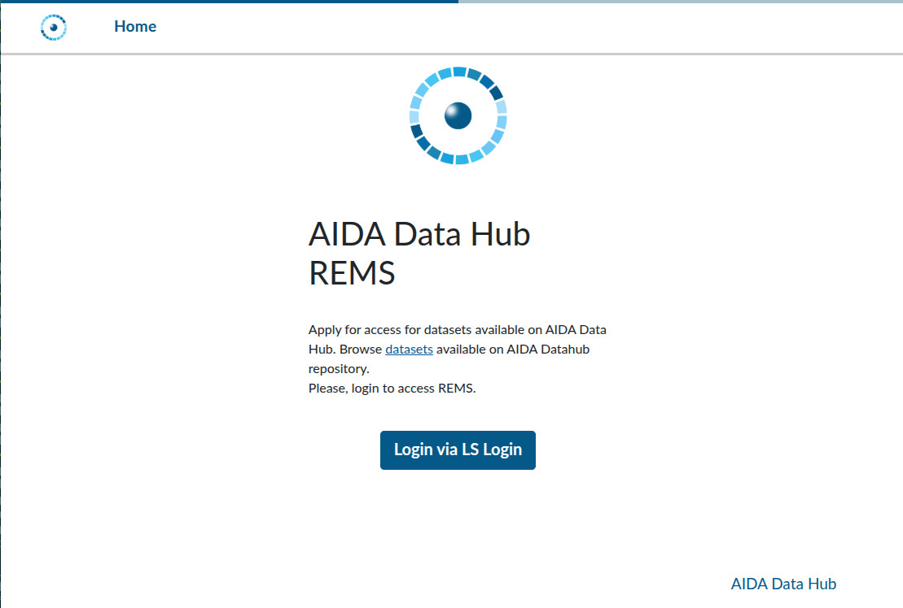
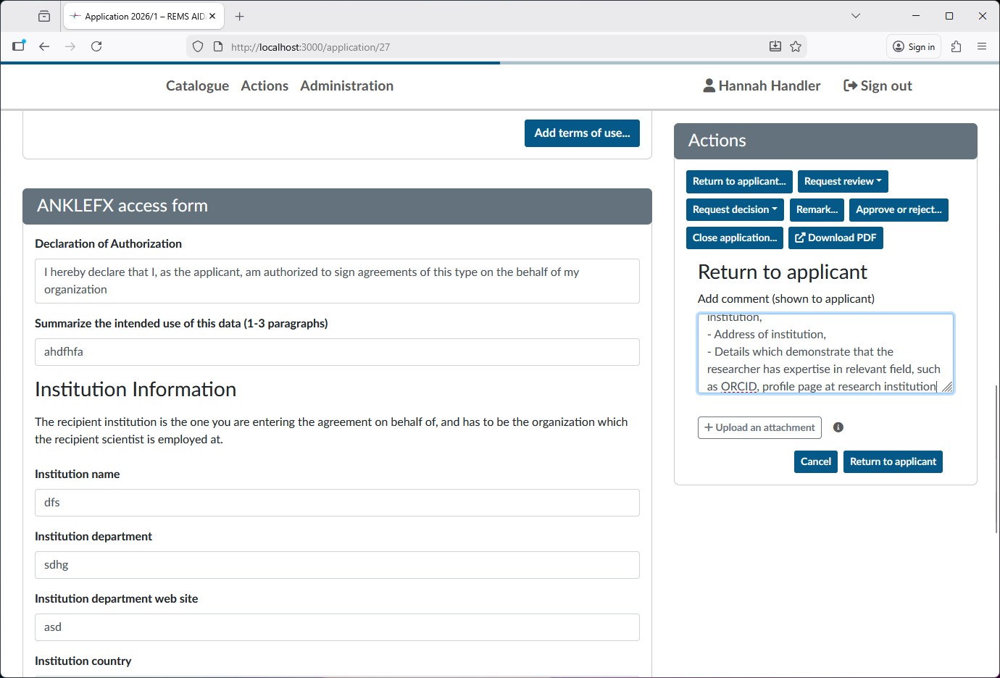
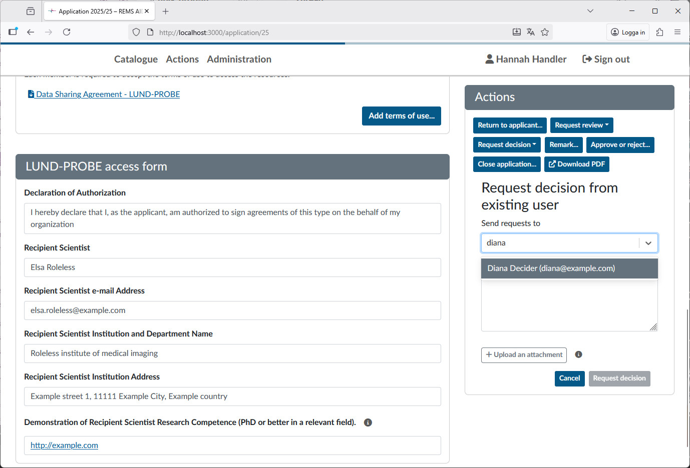
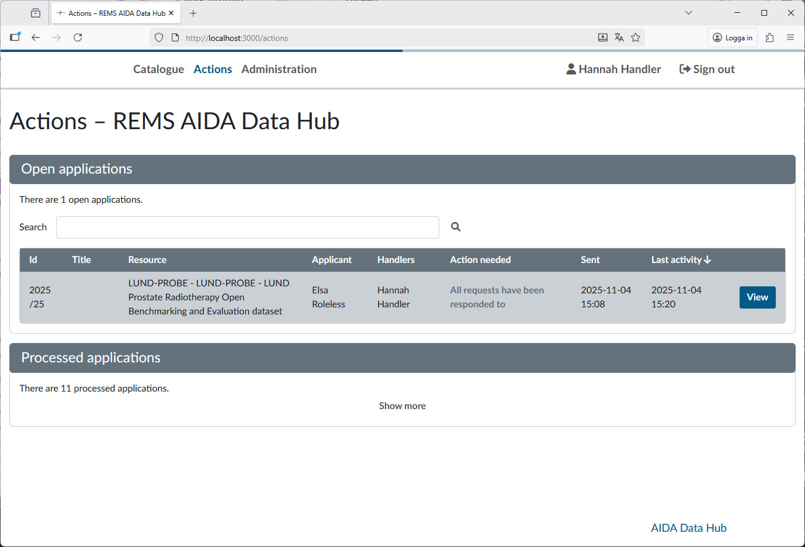
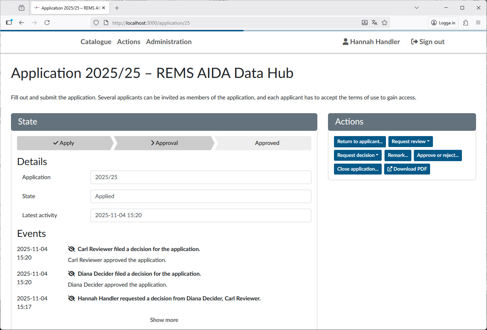
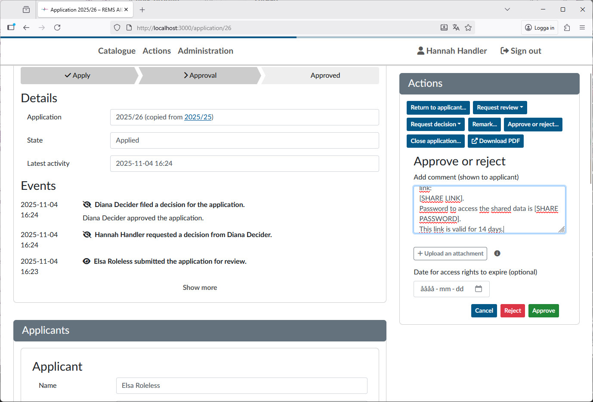

# Data sharing requests - Handler guide

This is a guide of how to process data sharing requests on REMS as a handler.

Once a request for data sharing has been sent to REMS, a handler must review it. If the application looks good, the handler then sends it to the designated decider for that dataset.

he first thing you need to do as a handler is to login at <https://rems.dsp.aida.scilifelab.se/>



REMS uses **Life Science Login** to handle authentication. If you don't already have a user at Life Science login, please follow [this guide](../dsp/getting-started/life-science-login.md).

## Actions section - listing applications

As a handler, you will have the section **Actions** on the top of the window. Clicking it will present you will the following view:


Here you can see the open applications applications are awaiting actions. The _action needed_ column gives a brief overview of what needs to be done. Applications listed as _New application_ will need a handler to review it. Open the application by clicking `view`.

### The Application View

You will be shown the application as filled in by the requester:


At the top is a list of the events for this application. The events which the applicant sees has an open eye icon, while events hidden (such as requests for decision) are denoted by a crossed out eye. To the top right are the actions you as a handler can perform. The ones you will use are:

- `Return to applicant...`
- `Request decision`
- `Approve or reject`

The important details of the application is at the bottom:


These lists the details the applicant has given about the recipient scientist and is what you as a handler will use to review the application.

### Reviewing the application

Most datasets requires us to establish that the recipient scientist is trained in handling sensitive data. As a way of proving this, we have put a requirement on the recipient scientist to hold at least a PhD in a relevant field.
As a handler you need to look at the fields filled in by the applicant, follow the given links and information and make a conclusion that the recipient scientist have the required credentials.

- If you can't conclude that they do, follow the instructions under [Application is incomplete](#application-is-incomplete) below.
- If everything looks good, instead follow the instructions under [Application is complete](#application-is-complete).

#### Application is incomplete

If you cannot with reasonable effort establish that the recipient scientist is competent to handle medical data, return the application (use the action **Return to applicant**) to the requester with the comment:

```text
Thank you for your interest in this dataset. We could not establish the identity of the recipient scientist with the given information. Please read https://docs.datahub.aida.scilifelab.se/data/data-sharing-request/#rejected-applications for further details. Please clarify the following:

- Name of recipient scientist,
- Recipient scientist e-mail for the workplace institution,
- Name and department of recipient scientist institution,
- Address of institution,
- Details which demonstrate that the researcher has expertise in relevant field, such as ORCID, profile page at research institution
```

Remove any of bullet points which are clear and don't need further details.



#### Application is complete

If the details of the recipient scientist looks correct and suitable, the next step is to send it to the decider. Use the **Request decision** action. Choose `from existing user...`:


This gives you a menu where you can search for the decider:



Add the necessary deciders to the list of deciders and choose `Request decision`. The application will now be waiting for decisions from the deciders.

## Approving the application

Once all deciders have made their decisions on an application, it will be listed under the _Actions_ with the text `All requests have been responded to`.



Once all deciders have responded, review the application again



Under the _Events_, you can see what the decisions are. If the deciders don't all approve the application, they will have given a comment with the rejection detailing the reason. Answer the applicant either with a `rejection` if the deciders comment is a hard reject or `Return to applicant...` if the reason is more about unclear details. In both cases reformulate the reason for rejection from the decider for the applicant to act on.

If all deciders approve the application, you should now finalize the `approval`. Before doing so, create the share link for downloading the dataset on NextCloud, then use the `Approve or reject...` action with the following text as a comment (replacing the link and password with the one created) with the approval:

```text
Thank you for your interest in this dataset. Your application has been approved and you can download the dataset from the following link:
[SHARE LINK]
Password to access the shared data is [SHARE PASSWORD]
This link is valid for 14 days.
```



Once you've filled in these details, approve the applications and you're done!
