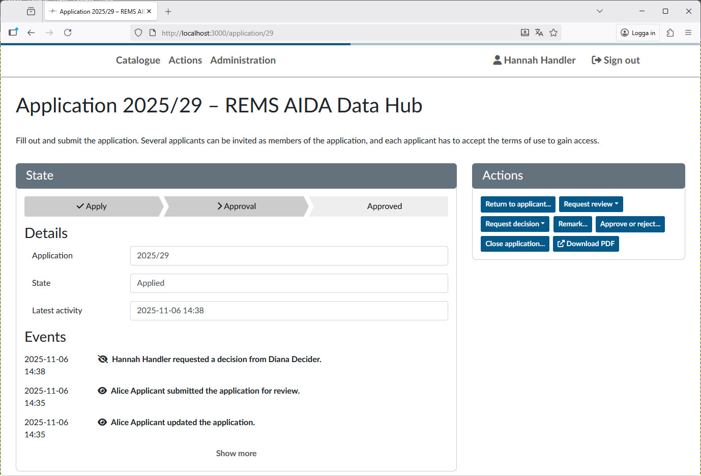
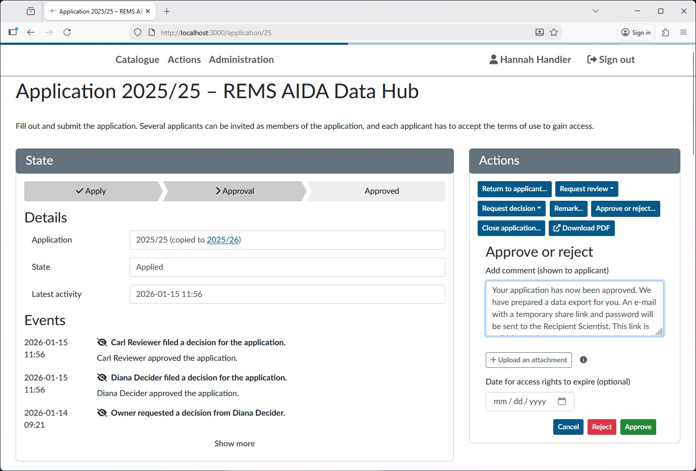
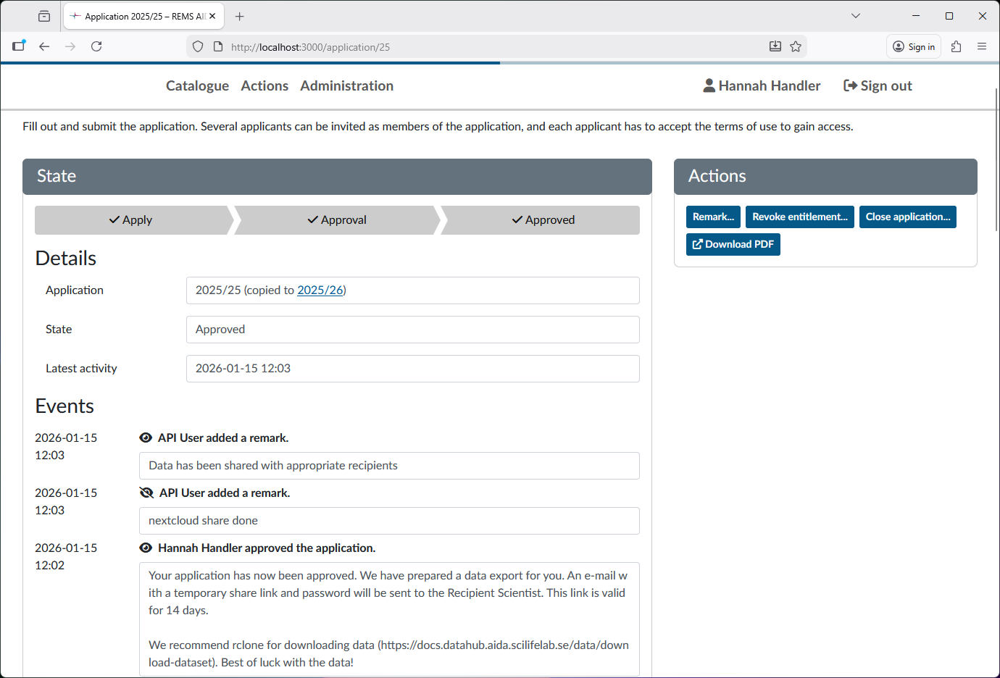
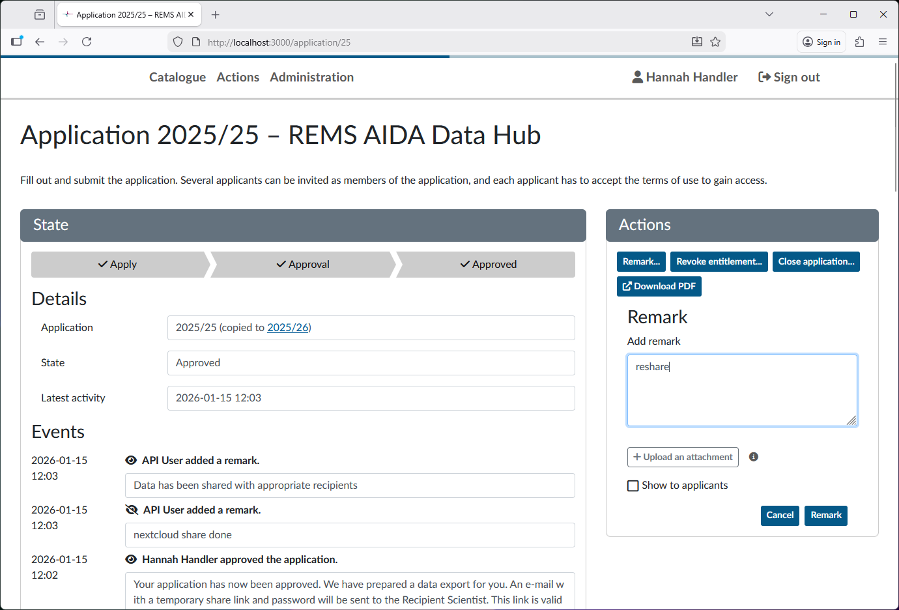
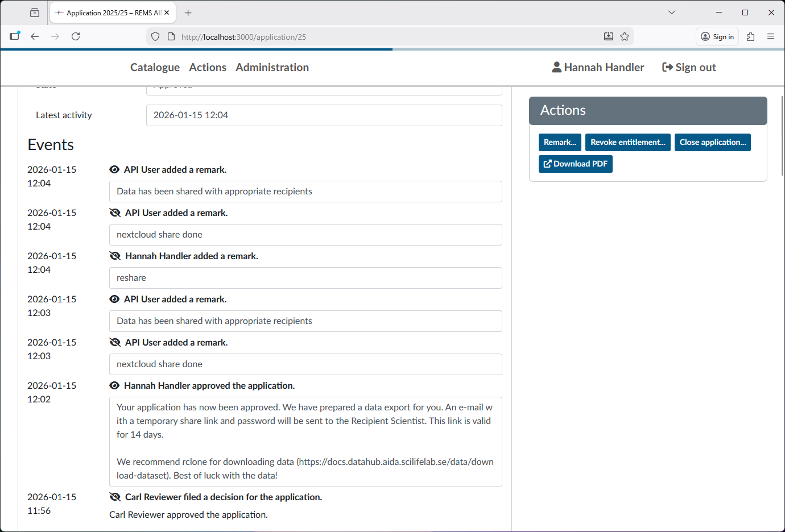

# Data sharing requests - Handler guide

This is a guide of how to process data sharing requests on REMS as a handler.

Once a request for data sharing has been sent to REMS, a handler must review it. If the application looks correct, the handler then sends it to the designated decider for that dataset.

The first thing you need to do as a handler is to login at <https://rems.dsp.aida.scilifelab.se/>


REMS uses **Life Science Login** to handle authentication. If you don't already have a user at Life Science login, please follow [this guide](../dsp/getting-started/life-science-login.md).

## Actions section - listing applications

As a handler, you will have the section **Actions** on the top of the window. Clicking it will present you will the following view:


Here you can see the open applications awaiting actions. The _action needed_ column gives a brief overview of what needs to be done. Applications listed as _New application_ will need a handler to review it. Open the application by clicking `view`.

### The Application View

You will be shown the application as filled in by the requester:


At the top is a list of the events for this application. The events which the applicant sees have an open eye icon, while events hidden (such as requests for decision) are denoted by a crossed out eye. To the top right are the actions you as a handler can perform. The ones you will use are:

- `Return to applicant...`
- `Request decision`
- `Approve or reject`

The important details of the application is at the bottom:


These lists the details the applicant has given about the recipient scientist and is what you as a handler will use to review the application.

### Reviewing the application

Most datasets require us to establish that the recipient scientist is trained in handling sensitive data. As a way of proving this, we have put a requirement on the recipient scientist to hold at least a PhD in a relevant field.
As a handler you need to look at the fields filled in by the applicant, follow the given links and information and make a conclusion that the recipient scientist has the required credentials.
We also need it to be clearly established that the recipient scientist is connected to the institution indicated in the application, meaning that their email address is their institutional one and that there is some profile page or verified ORCID connection to it.

- If the application does not clearly show the above, follow the instructions under [Application is incomplete and should not be ammended](#application-is-incomplete-and-should-not-be-ammended) if this application would never be approved (e.g. from a region we're not allowed to share with) or [Application is incomplete but can be ammended](#application-is-incomplete-but-can-be-ammended) if the application is just missing enough information.
- If everything looks good, instead follow the instructions under [Application is complete](#application-is-complete).

Often, the application will have multiple members invited. To process an application, only the dataset recipient needs to have logged in and approved of the agreement. The status of other invited members is not a blocker for reviewing the application.

#### Application is incomplete and should not be ammended

In the case that the application is very incomplete or the dataset cannot be shared due to e.g. policy, use the `reject` option under the `Approve or reject...` action with a comment detailing why the application is rejected. This comment will be visible to the applicant.

#### Application is incomplete but can be ammended

If you cannot with reasonable effort establish that the recipient scientist is competent to handle medical data, return the application (use the action **Return to applicant**) to the requester with the comment:

```text
Thank you for your interest in this dataset. We could not establish the identity of the recipient scientist with the given information. Please read https://docs.datahub.aida.scilifelab.se/data/data-sharing-request/#rejected-applications for further details. Please clarify the following:

- Name of recipient scientist,
- Recipient scientist e-mail for the workplace institution,
- Name and department of recipient scientist institution,
- Address of institution,
- Details which demonstrate that the researcher has expertise in relevant field, such as ORCID, profile page at research institution
```

Remove the bullet points which are clear and don't need further details.


#### Application is complete

If the details of the recipient scientist look correct and suitable, the next step is to send it to the decider.
To do this, use the `Remark...` action to add a trigger text which the automated system will pick up on.
This gives you a text field where you can enter a remark (by default not visible to the applicant). Use the string `send to deciders` to trigger the automatic sending. **Note that the spelling must be exact, incorrect strings will be silently ignored.**


After the automated script has been run (every 5 minutes) the deciders will have been added to the application. The automated script will re-add deciders who have not answered within 24 hours to trigger a reminder.

If you need to re-request decisions from all deciders (e.g. for a resubmitted application) you can add the `send to deciders` remark again.

#### Track application status

You can view the status of the application in the _Actions_ section, where the status will be "Waiting for decision"


If you need details about what decider you are waiting on (in the case of multiple deciders) you can go into the application (via the `View` button) and look at the _Events_ list:



## Approving the application

Once all deciders have made their decisions on an application, it will be listed under the _Actions_ with the text `All requests have been responded to`.


Once all deciders have responded, review the application again


Under the _Events_, you can see what the decisions are. If the deciders don't all approve the application, they will have given a comment with the rejection detailing the reason.

Answer the applicant either with a `rejection` if the deciders comment is a hard reject or `Return to applicant...` if the reason is more about unclear details. In both cases reformulate the reason for rejection from the decider for the applicant to act on.

If all deciders approve the application, you should now finalize the approval. Use the `Approve or reject...` action with the text below as a comment (will be visible to the applicant). Note that for datasets where there is no recipient scientist (e.g. datasets for educational purpose) replace "Recipient Scientist" above with "Applicant".

```text
Your application has now been approved. We have prepared a data export for you. An e-mail with a temporary share link and password will be sent to the Recipient Scientist. This link is valid for 14 days.
 
We recommend rclone for downloading data (https://docs.datahub.aida.scilifelab.se/data/download-dataset). Best of luck with the data!
```



Once you've filled in the comment, approve the applications and you're done! After the management script has been run (every 5 minutes), the link will have been created and sent to the applicants email address. You can see the events detailing this in the events section.



### Automatic creating of share links

The automated application managment system will create a link and password for the NextCloud repository and automatically send them via e-mail to the recipient scientist (or applicant). This link is valid for 14 days.

If you need to trigger the automated sharing system again, use the `Remark action...` and enter the string `reshare` which will trigger a new sharing of the dataset to the recipient scientist as above.



After the management script has run (every 5 minutes), the data will have been reshared with the same recipient as the original share.


