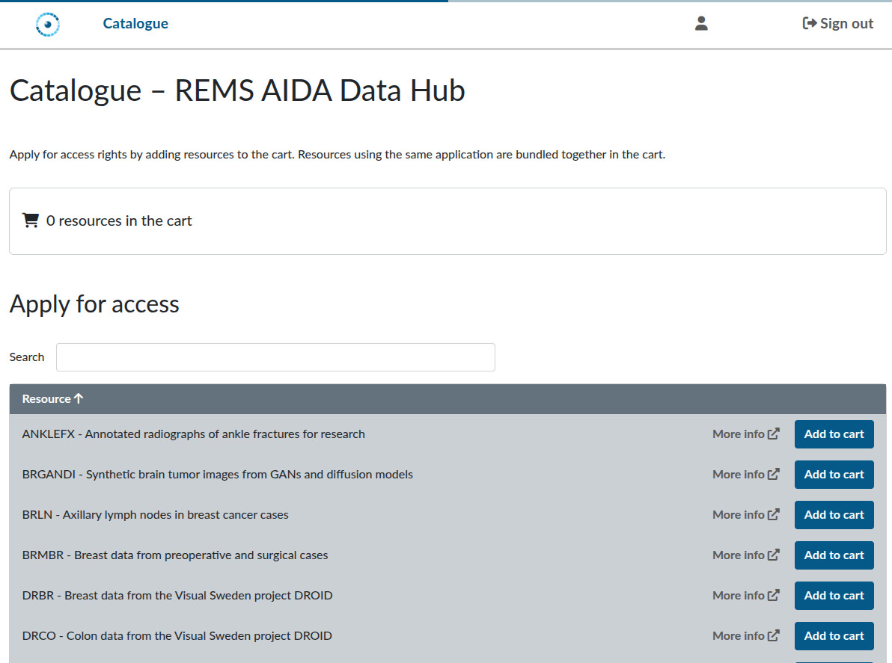
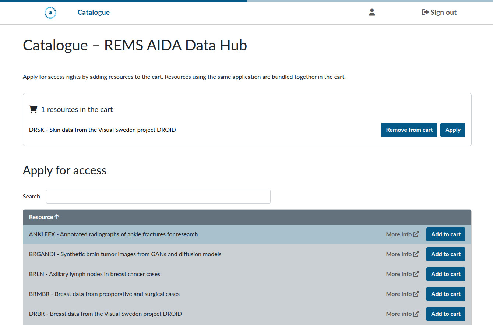
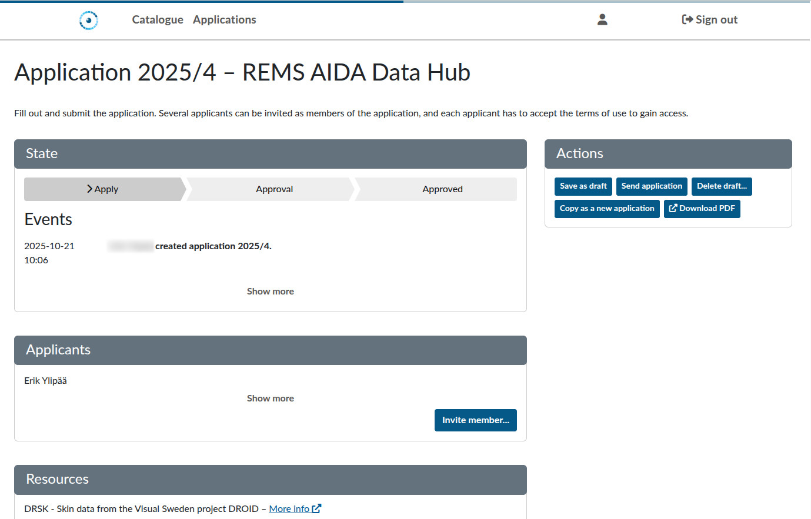
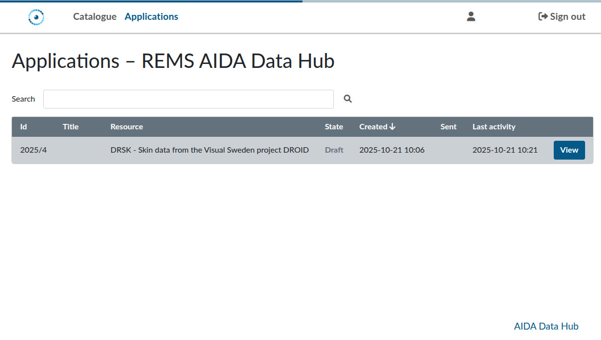

# Requesting access to AIDA Data Hub dataset through REMS

Most datasets on the AIDA Data Hub use [REMS](https://github.com/CSCfi/rems) (Resource Entitlement Management System) to manage requests for and access to datasets. This system allows you to apply for access to datasets and for handlers to review your application. Before you request access to a dataset, you must first login at <https://rems.dsp.aida.scilifelab.se/>

To login to REMS, you need to authenticate using **Life Science Login**. If you don't already have a user at Life Science login, please follow [this guide](../dsp/getting-started/life-science-login.md).

## Using REMS

Once you have authenticated using Life Science login, you will be redirected back to REMS, you will see the dataset catalogue:

Here you can browse all available datasets and add them to a cart. Each application still needs to be done one at a time, but the cart allows you to collect datasets of interest before beginning the application process. After you've added a dataset to the basket, you will have the option to apply for access:

### Applying for access

To apply for a dataset, click the `Apply` button. This will take you to the application form.

This form has multiple fields which needs to be filled in. All datasets have some form of agreement you need to accept. Often, these are in the form of PDF attachment which you need to download and review before agreeing.

Many datasets also have mandatory fields to demonstrate that the recipient researcher is qualified to conduct ethical research using medical data. Details about the researcher are required for us to lawfully share the data. For further details, see the section [Legal explanation](#legal-explanation).

At the top right of the application form, you will find a set of available **actions**:

- **Save as draft:** Save the current state of your application without submitting it. You can continue working on it later.  
- **Send application:** Submit the application for processing. It will appear in your list of applications.  
- **Delete draft:** Delete the application, removing it from your list of applications.  
- **Copy as new application:** Create a new application for the same dataset, with the same filled-in details.
- **Download PDF:** Download a PDF version of the application.

Once you have filled in the application, use the **Send application** action to submit it for processing. A handler will manually review your application. Once the review is complete, you will receive a decision, either **approval** or **rejection**.

#### Approved applications

If your application is approved, you will receive an email with instructions on how to access the dataset. **Please note that download credentials are time-limited, so be sure to use them promptly.**

#### Rejected applications

A rejection usually means that the handler could not, with *reasonable effort*, verify that the recipient researcher meets the legal requirements to receive the data (see [Legal explanation](#legal-explanation)). If your application is rejected due to insufficient information, you are welcome to submit a new one, but please ensure that:

- The recipient researcher holds at least a PhD in a relevant field.  
- The researcher's email address is clearly associated with the stated institution.  
- The researcher's profile page and other supporting links clearly demonstrate competence in conducting ethical medical research in a relevant field.  

The clearer the researcher’s credentials are (e.g., an institutional email address, a detailed institutional profile page, and a publication record or position relevant to the field), the easier it will be for the handler to process the application.

### The Application listing

You can see the status of your applications in REMS under the **Applications** menu:

You can continue working on your saved drafts, as well as review your submitted applications.

## Legal explanation

As a policy, we require the recipient researcher to hold at least a PhD in a relevant field.
This requirement has to do with the legal framework under which the data can be shared. 

This requirement is based on the legal framework governing data sharing. According to Swedish law, clinical datasets can be shared only when used for research activities conducted under the supervision of a qualified researcher, someone with the necessary scientific competence to ensure that research is carried out as described in the ethical review application and in accordance with institutional policies.

For a more detailed discussion of the legal framework surrounding the sharing of clinical data in Sweden, please see the [Legal Discussion](https://datahub.aida.scilifelab.se/sharing/legal/) on the AIDA Data Hub.
