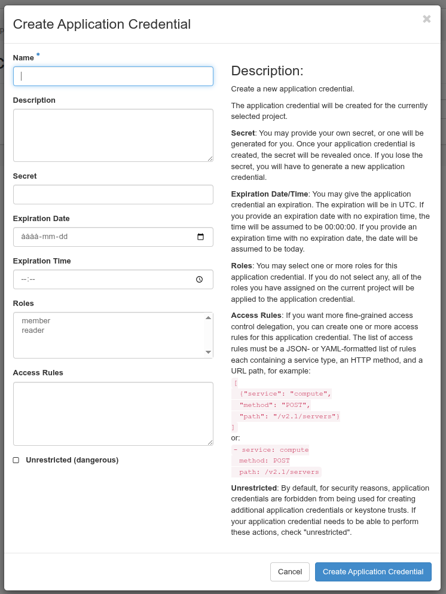
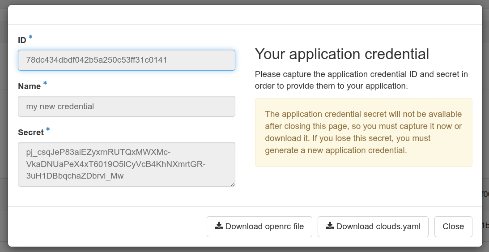

# Remote cloud access

Remote control is available for API usage and command line usage.

DSP uses OpenStack and can be controlled with the
[python openstack client](https://pypi.org/project/python-openstackclient/).

## Getting the client

If it's not available natively in your environment (e.g. Ubuntu has a
`python3-openstackclient` package), you can install the client from standard
sources, typically this will look like:

```bash
user@host:~$ python3 -mvenv openstackenvironment
user@host:~$ . openstackenvironment/bin/activate
(openstackenvironment) user@host:~$ pip install python-openstackclient
Collecting python-openstackclient
[..]
Successfully installed [..]
```

## Application credentials

To access the API, you need to use application credentials, available in
OpenStack Horizon under Identity -> Application Credentials.

From that panel, you can request the creation of a new application credential
by clicking the button "Create Application Credential".


Clicking it will open the dialog to create a new set of application credentials.



You must give your application credential a name and can optionally enter a
descripition.

Once created, the application will be protected by a secret. This can be
provided by your or generated automatically (for many uses you do not need to
manage this directly).

If desired, it can be restricted how the application can be used (what
operations it's allowed for). It's also possible to determine when it should
expires. We recommend setting an expiration date no more than a year in the
future.

[!IMPORTANT] For security reasons, we will start enforcing a finite life span
for application credentials. The exact details of this is still to be
determined, though.

If you press the "Create Application Credential" button, the credential will
be created and shown. If you didn't specify a secret, the generated secret will
also be shown.



For most uses, downloading the `clouds.yaml` or `openrc` file will be suitable
and will contain the information needed to use the secret.

The application credentials panel also allows you to delete an application
credential if it's no longer needed.

## Connecting

Assuming the client is installed in `PATH` per above and there is a downloaded
openrc file, it can be used as such:

```bash
user@host:~$ . ~/path/to/downloaded-openrc.sh
user@host:~$ openstack server list
+--------------------------------------+--------+--------+---------------------------------------+--------------------------+---------------------+
| ID                                   | Name   | Status | Networks                              | Image                    | Flavor              |
+--------------------------------------+--------+--------+---------------------------------------+--------------------------+---------------------+
| f353bdf8-9ab1-4b2b-b75c-4e0ab0d4c28b | test | ACTIVE | aidadatahubtest-net=10.36.138.141       | N/A (booted from volume) | verdi-sixteenthnode |
+--------------------------------------+--------+--------+---------------------------------------+--------------------------+---------------------+
```

it's also possible to use the YAML file:

```bash
user@host:~$ OS_CLIENT_CONFIG_FILE=~/path/to/downloaded-openrc.sh
user@host:~$ export OS_CLIENT_CONFIG_FILE
user@host:~$ openstack server list
+--------------------------------------+--------+--------+---------------------------------------+--------------------------+---------------------+
| ID                                   | Name   | Status | Networks                              | Image                    | Flavor              |
+--------------------------------------+--------+--------+---------------------------------------+--------------------------+---------------------+
| f353bdf8-9ab1-4b2b-b75c-4e0ab0d4c28b | test | ACTIVE | aidadatahubtest-net=10.36.138.141       | N/A (booted from volume) | verdi-sixteenthnode |
+--------------------------------------+--------+--------+---------------------------------------+--------------------------+---------------------+
```
