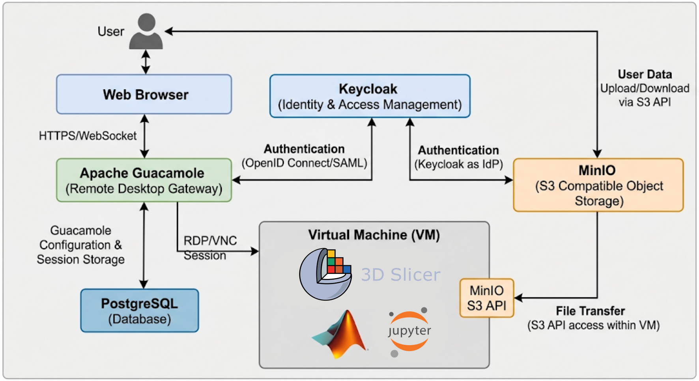

# Secure Remote Desktop with Guacamole, Keycloak, and MinIO

This tutorial walks through the local **Secure Remote Desktop (SRD)** stack
defined under `compose/`. Docker Compose brings up browser login, remote
desktop over RDP, and object storage for file sharing on your machine.

## Topics

In this example you will:

1. Understand each Compose service and how they connect.
2. Configure `.env` and start the stack.
3. Sign in through Keycloak, open a Guacamole remote desktop, and move files
   with MinIO and Guacamole SFTP (drag and drop).
4. Add Guacamole connections and users with the helper scripts in the repo root.

This example assumes Docker Engine with Compose v2 and basic familiarity with
browsers, RDP, and environment variables.

## Instructions

### 1. Architecture: components and how Remote Desktop works

```text
Browser  →  Guacamole (/remote-desktops)  →  RDP  →  Remote Desktop (VM)
              ↑ Auth (OpenID)                    ↑ S3 / console
           Keycloak                           MinIO
              ↑
           PostgreSQL (Guacamole config & sessions)
```



**End-to-end flow:**

1. You open Guacamole in a browser at `/remote-desktops/`.
2. Guacamole redirects you to **Keycloak** (OpenID Connect) to authenticate.
3. After login, Guacamole loads your allowed connections from **PostgreSQL** and
   asks **guacd** to open an **RDP** session to the **remote-desktop** container
   (Ubuntu XRDP). The image is currently packaged with preinstalled **3D Slicer**
   and **LibreOffice**.
4. Inside the desktop (and from your host), **MinIO** provides S3-compatible
   storage and a web console for upload and download.
5. **SFTP is enabled by default** on the Guacamole RDP connection, so you can
   also drag and drop files from your local machine into the remote desktop
   through the Guacamole UI (files land under `/home/ubuntu` via SSH/SFTP on
   the desktop container).

- **keycloak**: Identity provider. Hosts the `maia` realm and OpenID client
  used by Guacamole.
- **keycloak-init**: One-shot setup: creates realm `maia`, confidential client,
  groups mapper, and the demo admin user.
- **postgres-init**: One-shot schema seed: copies Guacamole JDBC SQL and injects
  `MAIA_USER_EMAIL` into the RDP seed.
- **postgresql**: Guacamole database: users, permissions, and the
  **Remote Desktop** RDP connection.
- **guacd**: Guacamole daemon: speaks RDP (and related protocols); Guacamole
  proxies the browser session through it.
- **guacamole**: Web UI and gateway at `/remote-desktops`. Prefer OpenID
  (`EXTENSION_PRIORITY=openid,*`).
- **remote-desktop-home-init**: One-shot: owns `remote-desktop-home` as uid/gid
  `1000` with mode `700` on `/home/ubuntu`.
- **remote-desktop**: Ubuntu desktop over RDP (`maiacloudai/ubuntu-xrdp`).
  Currently packaged with preinstalled **3D Slicer** and **LibreOffice**.
  Receives RDP from guacd; MinIO credentials and URLs as env vars; SSH/SFTP on
  port `2022` for Guacamole file transfer.
- **minio**: S3-compatible object store (API + console) for shared files.
- **minio-init**: One-shot: creates a console user with `consoleAdmin` (root
  stays for server admin).

**Startup order (simplified):** Keycloak healthy → keycloak-init → postgres-init
→ PostgreSQL → guacd + guacamole → remote-desktop-home-init → MinIO →
minio-init → remote-desktop.

Persistent data lives in Docker volumes: `keycloak-data`, `postgres-data`,
`remote-desktop-home`, `minio-data`.

### 2. Prerequisites

- Docker Engine with Compose v2
- Free host ports (defaults): `8080` (Keycloak), `8081` (Guacamole), `5432`
  (Postgres), `9000`/`9001` (MinIO), `3389` (RDP), `2022` (SSH/SFTP), `4822`
  (guacd)

The default `.env` uses **`localhost`** for all browser-facing OpenID and MinIO
URLs, so no custom DNS or `/etc/hosts` entry is required.

### 3. Configure all `.env` variables

Credentials and URLs live in `compose/.env`. Change them **before the first
`docker compose up`** when possible; some values are baked into volumes on first
init.

Copy a personal file if you like:

```bash
cd compose
cp .env .env.local
```

#### Full variable reference

- `KEYCLOAK_ADMIN`: Bootstrap admin for Keycloak **master** realm (`/admin`)
- `KEYCLOAK_ADMIN_PASSWORD`: Password for that bootstrap admin
- `KEYCLOAK_HTTP_PORT`: Host port for Keycloak (default `8080`)
- `POSTGRES_DB`: Guacamole JDBC database name
- `POSTGRES_USER`: DB user Guacamole connects as
- `POSTGRES_PASSWORD`: DB password
- `POSTGRES_PORT`: Host port for PostgreSQL
- `GUACD_PORT`: Host port for guacd (default `4822`)
- `GUACAMOLE_HTTP_PORT`: Host port for Guacamole (default `8081`)
- `OPENID_AUTHORIZATION_ENDPOINT`: Browser-facing Keycloak auth URL
- `OPENID_JWKS_ENDPOINT`: JWKS URL Guacamole uses to verify tokens (often the
  Docker service name `keycloak`)
- `OPENID_ISSUER`: Issuer claim Guacamole expects (must match Keycloak)
- `OPENID_CLIENT_ID`: OIDC client id (default `maia`)
- `OPENID_CLIENT_SECRET`: Confidential client secret for Guacamole / Keycloak
- `OPENID_USERNAME_CLAIM_TYPE`: Claim used as Guacamole username (default
  `email`)
- `OPENID_REDIRECT_URI`: Post-login return URL (Guacamole public URL +
  `/remote-desktops/`)
- `MAIA_USER_EMAIL`: Demo user in realm `maia`; also Guacamole admin entity
  name
- `MAIA_USER_PASSWORD`: Password for that demo user
- `REMOTE_DESKTOP_RDP_PORT`: Host port for direct RDP (default `3389`)
- `REMOTE_DESKTOP_SSH_PORT`: Host port for SSH/SFTP used by Guacamole file
  transfer (default `2022`)
- `REMOTE_DESKTOP_TZ`: Timezone inside the remote desktop (default `Etc/UTC`)
- `MINIO_ROOT_USER` / `MINIO_ROOT_PASSWORD`: MinIO server root (API admin);
  used by `minio-init`
- `MINIO_CONSOLE_USER` / `MINIO_CONSOLE_PASSWORD`: Console login; also injected
  into **remote-desktop**
- `MINIO_API_PORT` / `MINIO_CONSOLE_PORT`: Host ports for S3 API and console
- `MINIO_ENDPOINT` / `MINIO_CONSOLE_URL`: URLs passed into the remote desktop
  for MinIO access

#### Default public URLs (`localhost`)

```env
OPENID_AUTHORIZATION_ENDPOINT=http://localhost:8080/realms/maia/protocol/openid-connect/auth
OPENID_JWKS_ENDPOINT=http://localhost:8080/realms/maia/protocol/openid-connect/certs
OPENID_ISSUER=http://localhost:8080/realms/maia
OPENID_REDIRECT_URI=http://localhost:8081/remote-desktops/
MINIO_ENDPOINT=http://localhost:9000
MINIO_CONSOLE_URL=http://localhost:9001
```

Keep **issuer**, **authorization**, and **redirect** URLs consistent with what
the **browser** uses (`localhost` and the ports above by default). Always
include the `/remote-desktops/` path (and trailing slash) in
`OPENID_REDIRECT_URI`.

### 4. Start the stack

From the `compose` directory:

```bash
cd compose
docker compose up -d
```

Watch first-boot init:

```bash
docker compose logs -f keycloak-init postgres-init remote-desktop-home-init minio-init
```

When the stack is up:

- **Guacamole**: <http://localhost:8081/remote-desktops/>
  Sign in via Keycloak
- **Keycloak admin**: <http://localhost:8080/admin>
  `KEYCLOAK_ADMIN` / `KEYCLOAK_ADMIN_PASSWORD`
- **MinIO console**: <http://localhost:9001>
  `MINIO_CONSOLE_USER` / `MINIO_CONSOLE_PASSWORD`
- **MinIO API**: <http://localhost:9000>
  Root: `MINIO_ROOT_USER` / `MINIO_ROOT_PASSWORD`
- **Postgres**: `localhost:5432`
  `POSTGRES_USER` / `POSTGRES_PASSWORD`, DB `POSTGRES_DB`
- **Direct RDP**: `localhost:3389`
  OS user `ubuntu` / `ubuntu` (not the Keycloak account)
- **SSH/SFTP**: `localhost:2022`
  `ubuntu` / `ubuntu` (used by Guacamole SFTP)

### 5. First login: Keycloak → Guacamole → Remote Desktop

1. Open Guacamole at <http://localhost:8081/remote-desktops/> (adjust the port
   if you changed `GUACAMOLE_HTTP_PORT` in `.env`).
2. You are redirected to Keycloak (`maia` realm).
3. Sign in with `MAIA_USER_EMAIL` / `MAIA_USER_PASSWORD` (defaults:
   `admin@maia.dsp.se` / `admin`).
4. After redirect back, open the **Remote Desktop** connection. Guacamole uses
   guacd → RDP → remote-desktop. When the desktop prompts for a local login,
   use **`ubuntu` / `ubuntu`**.

That Keycloak user is also seeded in Postgres as a Guacamole administrator with
rights on the Remote Desktop connection.

### 6. File sharing: MinIO and Guacamole SFTP drag and drop

#### MinIO (object storage)

From the host or inside the remote desktop, open the MinIO console
(`MINIO_CONSOLE_URL`) and sign in with `MINIO_CONSOLE_USER` /
`MINIO_CONSOLE_PASSWORD`. Create buckets and upload or download objects over the
S3 API (`MINIO_ENDPOINT`). The remote-desktop container receives these
credentials and URLs as environment variables so tools inside the session can
talk to MinIO without hard-coding secrets in the image.

Prefer the console user for day-to-day UI login; keep the root user for
bootstrap and `mc` admin work.

#### Guacamole SFTP (drag and drop into the desktop)

The RDP connection is configured with **`enable-sftp: true`**. Guacamole opens
a parallel SFTP channel to the remote desktop (`sftp-hostname` /
`REMOTE_DESKTOP_SSH_PORT`, user `ubuntu`) with root directory `/home/ubuntu`.

In the Guacamole session you can drag and drop files from your local machine
into the remote desktop; they appear under the user’s home directory without a
separate SFTP client. This is complementary to MinIO: SFTP is for files that
should land directly on the desktop filesystem; MinIO is for shared object
storage.

### 7. Add connections and users with helper scripts

The repo root includes shell helpers that talk to the Guacamole REST API (and,
for users, Keycloak). They default to Guacamole’s database admin
`guacadmin` / `guacadmin` and URLs for a local Compose stack. Adjust
`GUACAMOLE_URL`, credentials, emails, and connection names as needed. Requires
`curl` and `jq`.

Run them from a machine that can reach Guacamole (and Keycloak for
`add_user.sh`), typically after `docker compose up -d`.

#### Add an RDP connection (SFTP enabled)

Script: [`add_connection.sh`](../add_connection.sh)

```bash
#!/bin/bash

GUACAMOLE_URL="http://localhost:8081/remote-desktops"
GUACAMOLE_DATA_SOURCE="postgresql"
GUACAMOLE_USERNAME="guacadmin"
GUACAMOLE_PASSWORD="guacadmin"
CONNECTION_NAME="Remote-Desktop"
SSH_PORT="2022"

authToken=$(curl -kX POST $GUACAMOLE_URL/api/tokens \
-H "Content-Type: application/x-www-form-urlencoded" \
-d "username=$GUACAMOLE_USERNAME&password=$GUACAMOLE_PASSWORD" | jq -r '.authToken')

curl -kX POST \
$GUACAMOLE_URL/api/session/data/$GUACAMOLE_DATA_SOURCE/connections?token=${authToken}\
     -H "Content-Type: application/json" \
     -d '{
           "parentIdentifier": "ROOT",
           "name": "'$CONNECTION_NAME'",
           "protocol": "rdp",
           "attributes": {},
           "parameters": {
             "hostname": "remote-desktop",
             "port": "3389",
             "username": "ubuntu",
             "password": "ubuntu",
             "security": "any",
             "ignore-cert": "true",
             "disable-copy": "true",
             "enable-sftp": "true",
             "sftp-hostname": "remote-desktop",
             "sftp-port": "'$SSH_PORT'",
             "sftp-username": "ubuntu",
             "sftp-password": "ubuntu",
             "sftp-root-directory": "/home/ubuntu",
             "sftp-directory": "/home/ubuntu"
           }
         }'
```

Note `enable-sftp: true` and the `sftp-*` parameters: that is what enables
browser drag-and-drop file transfer into the remote desktop.

#### Add a user (Guacamole + Keycloak)

Script: [`add_user.sh`](../add_user.sh)

```bash
#!/bin/bash

# Variables
GUACAMOLE_URL="http://localhost:8081/remote-desktops"
GUACAMOLE_DATA_SOURCE="postgresql"
GUACAMOLE_USERNAME="guacadmin"
GUACAMOLE_PASSWORD="guacadmin"

# Create user in Keycloak
KEYCLOAK_URL="${KEYCLOAK_URL:-http://localhost:8080}"
KEYCLOAK_REALM="${KEYCLOAK_REALM:-maia}"
KEYCLOAK_ADMIN="${KEYCLOAK_ADMIN:-admin}"
KEYCLOAK_ADMIN_PASSWORD="${KEYCLOAK_ADMIN_PASSWORD:-admin}"

# You can override these by passing them as environment variables or inline:
EMAIL="${EMAIL:-admin@maia.dsp.se}"
PASSWORD="${PASSWORD:-changeme}"

# Request Guacamole auth token
authToken=$(curl -skX POST "$GUACAMOLE_URL/api/tokens" \
  -H "Content-Type: application/x-www-form-urlencoded" \
  -d "username=$GUACAMOLE_USERNAME&password=$GUACAMOLE_PASSWORD" | jq -r '.authToken')

# Create user payload
USER_PAYLOAD=$(jq -n \
  --arg username "$EMAIL" \
  --arg password "$PASSWORD" \
  '{
    username: $username,
    password: $password,
    attributes: {}
  }'
)

# Create the user
curl -skX POST \
"$GUACAMOLE_URL/api/session/data/$GUACAMOLE_DATA_SOURCE/users?token=${authToken}"\
  -H "Content-Type: application/json" \
  -d "$USER_PAYLOAD"

echo "User $EMAIL created (if not already present)."


# Get Keycloak admin access token
KC_TOKEN=$(curl -sk -X POST \
  "${KEYCLOAK_URL}/realms/master/protocol/openid-connect/token" \
  -d "client_id=admin-cli" \
  -d "username=${KEYCLOAK_ADMIN}" \
  -d "password=${KEYCLOAK_ADMIN_PASSWORD}" \
  -d "grant_type=password" | jq -r '.access_token')

if [ -z "$KC_TOKEN" ] || [ "$KC_TOKEN" == "null" ]; then
  echo "Failed to obtain Keycloak admin token"
  exit 1
fi

# Create user in Keycloak
CREATE_USER_RESPONSE=$(curl -sk -o /dev/null -w "%{http_code}" -X POST \
  "${KEYCLOAK_URL}/admin/realms/${KEYCLOAK_REALM}/users" \
  -H "Content-Type: application/json" \
  -H "Authorization: Bearer $KC_TOKEN" \
  -d "{
    \"username\": \"$EMAIL\",
    \"email\": \"$EMAIL\",
    \"enabled\": true,
    \"emailVerified\": true
  }"
)

if [ "$CREATE_USER_RESPONSE" == "201" ] ||
   [ "$CREATE_USER_RESPONSE" == "409" ]; then
  echo "User $EMAIL exists or was created in Keycloak."
else
  echo "Failed to create user in Keycloak. HTTP status: $CREATE_USER_RESPONSE"
  exit 1
fi

# Get user ID from Keycloak
USER_ID=$(curl -sk -X GET \
  "${KEYCLOAK_URL}/admin/realms/${KEYCLOAK_REALM}/users?username=${EMAIL}" \
  -H "Authorization: Bearer $KC_TOKEN" | jq -r '.[0].id')

if [ -z "$USER_ID" ] || [ "$USER_ID" == "null" ]; then
  echo "Failed to retrieve Keycloak user ID for $EMAIL"
  exit 1
fi

# Set Keycloak user password
PASSWORD_PAYLOAD="{\"type\":\"password\",\"value\":\"$PASSWORD\",\"temporary\":false}"
curl -sk -X PUT \
  "${KEYCLOAK_URL}/admin/realms/${KEYCLOAK_REALM}/users/${USER_ID}/reset-password"\
  -H "Content-Type: application/json" \
  -H "Authorization: Bearer $KC_TOKEN" \
  -d "$PASSWORD_PAYLOAD"

echo "User $EMAIL password set in Keycloak."
```

Example:

```bash
EMAIL=user@maia.dsp.se PASSWORD=secret ./add_user.sh
```

OpenID username claim is email, so the Guacamole username must match the
Keycloak email.

#### Link a connection to an admin (READ + ADMINISTER)

Script: [`link_connection_to_admin.sh`](../link_connection_to_admin.sh)

```bash
#!/bin/bash

GUACAMOLE_URL="http://localhost:8081/remote-desktops"
GUACAMOLE_DATA_SOURCE="postgresql"
GUACAMOLE_USERNAME="guacadmin"
GUACAMOLE_PASSWORD="guacadmin"
EMAIL="admin@maia.dsp.se"
USERNAME="admin@maia.dsp.se"
CONNECTION_NAME="Remote-Desktop"

authToken=$(curl -kX POST $GUACAMOLE_URL/api/tokens \
-H "Content-Type: application/x-www-form-urlencoded" \
-d "username=$GUACAMOLE_USERNAME&password=$GUACAMOLE_PASSWORD" | jq -r '.authToken')

USER_IDENTIFIER=$(curl -s -kX GET \
"$GUACAMOLE_URL/api/session/data/$GUACAMOLE_DATA_SOURCE/users?token=${authToken}"\
  | jq -r --arg USERNAME "$USERNAME" '.[$USERNAME].username')

echo "USER_IDENTIFIER: $USER_IDENTIFIER"
CONNECTION_IDENTIFIER=$(curl -s -kX GET \
"$GUACAMOLE_URL/api/session/data/$GUACAMOLE_DATA_SOURCE/connections?token=${authToken}"\
  | jq -r --arg NAME "$CONNECTION_NAME" '.[] | select(.name == $NAME) | .identifier')
curl -kX PATCH \
"$GUACAMOLE_URL/api/session/data/postgresql/users/$USER_IDENTIFIER/permissions?token=${authToken}"\
     -H "Content-Type: application/json" \
     -d '[
           {
             "op": "add",
             "path": "/connectionPermissions/'"$CONNECTION_IDENTIFIER"'",
             "value": "READ"
           },
           {
             "op": "add",
             "path": "/systemPermissions",
             "value": "ADMINISTER"
           }
         ]'
```

#### Link a connection to a regular user (READ only)

Script: [`link_connection_to_user.sh`](../link_connection_to_user.sh)

```bash
#!/bin/bash

GUACAMOLE_URL="http://localhost:8081/remote-desktops"
GUACAMOLE_DATA_SOURCE="postgresql"
GUACAMOLE_USERNAME="guacadmin"
GUACAMOLE_PASSWORD="guacadmin"
EMAIL="user@maia.dsp.se"
USERNAME="user@maia.dsp.se"
CONNECTION_NAME="Remote-Desktop"

authToken=$(curl -kX POST $GUACAMOLE_URL/api/tokens \
-H "Content-Type: application/x-www-form-urlencoded" \
-d "username=$GUACAMOLE_USERNAME&password=$GUACAMOLE_PASSWORD" | jq -r '.authToken')

USER_IDENTIFIER=$(curl -s -kX GET \
"$GUACAMOLE_URL/api/session/data/$GUACAMOLE_DATA_SOURCE/users?token=${authToken}"\
  | jq -r --arg USERNAME "$USERNAME" '.[$USERNAME].username')

echo "USER_IDENTIFIER: $USER_IDENTIFIER"
CONNECTION_IDENTIFIER=$(curl -s -kX GET \
"$GUACAMOLE_URL/api/session/data/$GUACAMOLE_DATA_SOURCE/connections?token=${authToken}"\
  | jq -r --arg NAME "$CONNECTION_NAME" '.[] | select(.name == $NAME) | .identifier')
curl -kX PATCH \
"$GUACAMOLE_URL/api/session/data/postgresql/users/$USER_IDENTIFIER/permissions?token=${authToken}"\
     -H "Content-Type: application/json" \
     -d '[
           {
             "op": "add",
             "path": "/connectionPermissions/'"$CONNECTION_IDENTIFIER"'",
             "value": "READ"
           }
         ]'
```

Typical sequence for a new colleague:

```bash
EMAIL=user@maia.dsp.se PASSWORD=secret ./add_user.sh
# edit USERNAME/EMAIL in link_connection_to_user.sh if needed, then:
./link_connection_to_user.sh
```

### 8. Useful Compose commands and troubleshooting

```bash
# Start / stop
docker compose up -d
docker compose down

# Follow Guacamole + Keycloak
docker compose logs -f guacamole keycloak

# Recreate after .env edits
docker compose up -d --force-recreate

# Full reset of stack data (destructive)
docker compose down -v
```

After changing OpenID URLs or the Guacamole port:

```bash
docker compose up -d --force-recreate keycloak-init guacamole remote-desktop
```

Checklist:

- **Redirect / OpenID errors** — Browser host, `OPENID_ISSUER`, and
  `OPENID_REDIRECT_URI` must agree; re-run `keycloak-init` so client redirect
  URIs match.
- **No Remote Desktop connection** — Postgres seed runs only on empty data
  volumes; `MAIA_USER_EMAIL` must match the OpenID email claim.
- **Cannot reach Keycloak from Guacamole login** — Check `KEYCLOAK_HTTP_PORT`
  and that the browser can open `http://localhost:8080`.
- **MinIO login fails in remote desktop** — Confirm `minio-init` succeeded and
  recreate `remote-desktop` after credential changes.
- **Home permission errors** — Confirm `remote-desktop-home-init` completed
  (`chown 1000:1000`, mode `700` on `/home/ubuntu`).
- **SFTP drag and drop fails** — Confirm the connection has `enable-sftp`,
  `REMOTE_DESKTOP_SSH_PORT` is published, and SSH on the desktop accepts
  `ubuntu` / `ubuntu`.

### 9. File map

```text
compose/
  docker-compose.yml      # Service definitions and wiring
  .env                    # Ports, URLs, admin credentials
  Stack.png               # Architecture diagram
  secure-remote-desktop.md  # This tutorial
  keycloak/
    init-maia-realm.sh    # Realm, client, demo user
  initdb/
    003-rdp-remote-desktop.sql    # Guacamole admin user + Remote Desktop RDP connection

# Repo root helpers
add_connection.sh
add_user.sh
link_connection_to_admin.sh
link_connection_to_user.sh
```

For a shorter operational overview, see [README.md](README.md).
