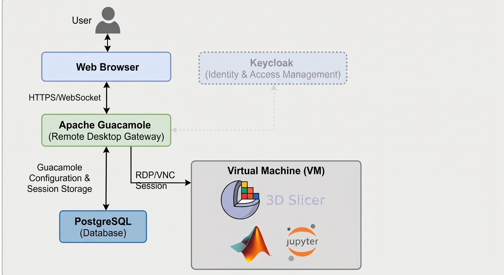

# Secure Remote Desktop 

This tutorial walks through the deployment of a local **Secure Remote Desktop (SRD)** stack
using Docker Compose. The stack is defined under `secure-remote-desktop/`.

## Topics

In this example you will:

1. Understand each Compose service and how they connect.
2. Configure `.env` and start the stack.
3. Sign in through Keycloak, open a Guacamole remote desktop, and move files
   with Guacamole SFTP (drag and drop).
4. Add Guacamole connections and users with the helper scripts in the
   `secure-remote-desktop/` directory.

## Prerequisites

This example assumes Docker Engine with Compose v2 and basic familiarity with
browsers, RDP, and environment variables.

To install Docker Engine, including Compose, follow the instructions available at [https://docs.docker.com/engine/install/](https://docs.docker.com/engine/install/).

Additionally, DSP secure environments block connections by default. However, DSP provides an
inspecting http proxy that enables downloading software and security updates
from public repositories that are trusted by AIDA Data Hub. DSP data science
images are preconfigured to make transparent use of this proxy, as demonstrated
in this next step.

To configure the VM to use the DSP proxy, run the following command:

```remote
curl http://10.253.254.250/ | bash
```

If you want to inspect the script, you can run:

```remote
curl http://10.253.254.250/ > dspconfigscript
cat dspconfigscript
```

and then run:

```remote
bash dspconfigscript
```

## Instructions

### 1. Architecture: components and how Remote Desktop works



**Components:**

- **keycloak**: Identity provider. Hosts the `srd` realm and OpenID client
  used by Guacamole.
- **keycloak-init**: One-shot setup: creates realm `srd`, confidential client,
  groups mapper, and the demo admin user (with default credentials `admin@srd.dsp.se` / `admin`).
- **PostgreSQL**: Guacamole database: users, permissions, and the
  **Remote Desktop** RDP connection.
- **guacd**: Guacamole daemon: speaks RDP (and related protocols); Guacamole
  proxies the browser session through it.
- **guacamole**: Web UI and gateway at `/remote-desktops`. Prefer OpenID
  (`EXTENSION_PRIORITY=openid,*`).
- **remote-desktop-home-init**: One-shot: owns `remote-desktop-home` as uid/gid
  `1000` with mode `700` on `/home/ubuntu`.
- **remote-desktop**: Ubuntu desktop over RDP (`maiacloudai/ubuntu-xrdp`).
  Currently packaged with preinstalled **3D Slicer** and **LibreOffice**.
  Receives RDP from guacd; SSH/SFTP on
  port `2022` for Guacamole file transfer.

**End-to-end flow:**

1. You open Guacamole in a browser at `http://localhost:8081/remote-desktops/`.
2. Guacamole redirects you to **Keycloak** (OpenID Connect) to authenticate.
3. After login, Guacamole loads your allowed connections from **PostgreSQL** and
   asks **guacd** to open an **RDP** session to the **remote-desktop** container
   (Ubuntu XRDP). The image is currently packaged with preinstalled **3D Slicer**
   and **LibreOffice**.
4. **SFTP is enabled by default** on the Guacamole RDP connection, so you can
   drag and drop files from your local machine into the remote desktop
   through the Guacamole UI (files land under `/home/ubuntu` via SSH/SFTP on
   the desktop container).


### 2. Variables configuration

Credentials and URLs live in `.env`. Change them **before the first
`docker compose up`** when possible.

One `test.env` example is available at [https://github.com/NBISweden/aida-datahub-docs/blob/main/docs/dsp/examples/secure-remote-desktop/test.env](https://github.com/NBISweden/aida-datahub-docs/blob/main/docs/dsp/examples/secure-remote-desktop/test.env).

To start from it, download it to your local machine and rename it to `.env`:

```bash
wget https://raw.githubusercontent.com/NBISweden/aida-datahub-docs/main/docs/dsp/examples/secure-remote-desktop/test.env -O .env
```

Then, through SFTP, copy it to the VM in the same directory as the `docker-compose.yml` file and edit it the `.env` file to your needs.

#### Full variable reference

- `KEYCLOAK_ADMIN`: Bootstrap admin for Keycloak **master** realm (default: `admin`)
- `KEYCLOAK_ADMIN_PASSWORD`: Password for that bootstrap admin (default: `admin`)
- `KEYCLOAK_HTTP_PORT`: Host port for Keycloak (default `8080`)
- `POSTGRES_DB`: Guacamole JDBC database name (default: `guacamole_db`)
- `POSTGRES_USER`: DB user Guacamole connects as (default: `guacamole_user`)
- `POSTGRES_PASSWORD`: DB password (default: `guacamole_password`)
- `POSTGRES_PORT`: Host port for PostgreSQL (default `5432`)
- `GUACD_PORT`: Host port for guacd (default `4822`)
- `GUACAMOLE_HTTP_PORT`: Host port for Guacamole (default `8081`)
- `OPENID_AUTHORIZATION_ENDPOINT`: Browser-facing Keycloak auth URL
- `OPENID_JWKS_ENDPOINT`: JWKS URL Guacamole uses to verify tokens (often the
  Docker service name `keycloak`)
- `OPENID_ISSUER`: Issuer claim Guacamole expects (must match Keycloak)
- `OPENID_CLIENT_ID`: OIDC client ID (default `srd`)
- `OPENID_CLIENT_SECRET`: Confidential client secret for Guacamole / Keycloak
- `OPENID_USERNAME_CLAIM_TYPE`: Claim used as Guacamole username (default
  `email`)
- `OPENID_REDIRECT_URI`: Post-login return URL (Guacamole public URL +
  `/remote-desktops/`)
- `USER_EMAIL`: Demo user in realm `srd`; also Guacamole admin entity
  name
- `USER_PASSWORD`: Password for that demo user
- `REMOTE_DESKTOP_RDP_PORT`: Host port for direct RDP (default `3389`)
- `REMOTE_DESKTOP_SSH_PORT`: Host port for SSH/SFTP used by Guacamole file
  transfer (default `2022`)
- `REMOTE_DESKTOP_TZ`: Timezone inside the remote desktop (default `Etc/UTC`)


#### Default public URLs (`localhost`)

```env
REMOTE_DESKTOP_URL=http://localhost:8081/remote-desktops/
KEYCLOAK_URL=http://localhost:8080
```

### 4. Start the stack

From the `secure-remote-desktop` directory:

```bash
docker compose up -d
```


When the stack is up:

- **Guacamole**: <http://localhost:8081/remote-desktops/>
  Sign in via Keycloak
- **Keycloak admin**: <http://localhost:8080/admin>
  `KEYCLOAK_ADMIN` / `KEYCLOAK_ADMIN_PASSWORD`
- **Postgres**: `localhost:5432`
  `POSTGRES_USER` / `POSTGRES_PASSWORD`, DB `POSTGRES_DB`
- **Direct RDP**: `localhost:3389`
  OS user `ubuntu` / `ubuntu` (not the Keycloak account)
- **SSH/SFTP**: `localhost:2022`
  `ubuntu` / `ubuntu` (used by Guacamole SFTP)

### 5. First login: Keycloak → Guacamole → Remote Desktop

1. Open Guacamole at <http://localhost:8081/remote-desktops/> (adjust the port
   if you changed `GUACAMOLE_HTTP_PORT` in `.env`).
2. You are redirected to Keycloak (`srd` realm).
3. Sign in with `USER_EMAIL` / `USER_PASSWORD` (defaults:
   `admin@srd.dsp.se` / `admin`).
4. After redirect back, open the **Remote Desktop** connection. Guacamole uses
   guacd → RDP → remote-desktop. If the desktop prompts for a local login,
   use **`ubuntu` / `ubuntu`**.


### 6. File sharing: Guacamole SFTP drag and drop

#### Guacamole SFTP (drag and drop into the desktop)

The RDP connection is configured with **`enable-sftp: true`**. Guacamole opens
a parallel SFTP channel to the remote desktop (`sftp-hostname` /
`REMOTE_DESKTOP_SSH_PORT`, user `ubuntu`) with root directory `/home/ubuntu`.

In the Guacamole session you can drag and drop files from your local machine
into the remote desktop; they appear under the user’s home directory without a
separate SFTP client.

### 7. Add connections and users with helper scripts

The `secure-remote-desktop/` directory includes shell helpers that talk to the
Guacamole REST API (and, for users, Keycloak). They default to Guacamole’s
database admin `guacadmin` / `guacadmin` and URLs for a local Compose stack.
Adjust `GUACAMOLE_URL`, credentials, emails, and connection names as needed.
Requires `curl` and `jq`:

```bash	
sudo apt-get install curl jq
```

Run them from a machine that can reach Guacamole (and Keycloak for
`add_user.sh`), typically after `docker compose up -d`.

#### Add an RDP connection (SFTP enabled)

Script: [`add_connection.sh`](secure-remote-desktop/add_connection.sh)

```bash
#!/bin/bash

GUACAMOLE_URL="http://localhost:8081/remote-desktops"
GUACAMOLE_DATA_SOURCE="postgresql"
GUACAMOLE_USERNAME="guacadmin"
GUACAMOLE_PASSWORD="guacadmin"
CONNECTION_NAME="Remote-Desktop"
SSH_PORT="2022"

authToken=$(curl -kX POST $GUACAMOLE_URL/api/tokens \
-H "Content-Type: application/x-www-form-urlencoded" \
-d "username=$GUACAMOLE_USERNAME&password=$GUACAMOLE_PASSWORD" | jq -r '.authToken')

curl -kX POST \
$GUACAMOLE_URL/api/session/data/$GUACAMOLE_DATA_SOURCE/connections?token=${authToken}\
     -H "Content-Type: application/json" \
     -d '{
           "parentIdentifier": "ROOT",
           "name": "'$CONNECTION_NAME'",
           "protocol": "rdp",
           "attributes": {},
           "parameters": {
             "hostname": "remote-desktop",
             "port": "3389",
             "username": "ubuntu",
             "password": "ubuntu",
             "security": "any",
             "ignore-cert": "true",
             "disable-copy": "true",
             "enable-sftp": "true",
             "sftp-hostname": "remote-desktop",
             "sftp-port": "'$SSH_PORT'",
             "sftp-username": "ubuntu",
             "sftp-password": "ubuntu",
             "sftp-root-directory": "/home/ubuntu",
             "sftp-directory": "/home/ubuntu"
           }
         }'
```

Note `enable-sftp: true` and the `sftp-*` parameters: that is what enables
browser drag-and-drop file transfer into the remote desktop.

#### Add a user (Guacamole + Keycloak)

Script: [`add_user.sh`](secure-remote-desktop/add_user.sh)

```bash
#!/bin/bash

# Variables
GUACAMOLE_URL="http://localhost:8081/remote-desktops"
GUACAMOLE_DATA_SOURCE="postgresql"
GUACAMOLE_USERNAME="guacadmin"
GUACAMOLE_PASSWORD="guacadmin"

# Create user in Keycloak
KEYCLOAK_URL="${KEYCLOAK_URL:-http://localhost:8080}"
KEYCLOAK_REALM="${KEYCLOAK_REALM:-srd}"
KEYCLOAK_ADMIN="${KEYCLOAK_ADMIN:-admin}"
KEYCLOAK_ADMIN_PASSWORD="${KEYCLOAK_ADMIN_PASSWORD:-admin}"

# You can override these by passing them as environment variables or inline:
EMAIL="${EMAIL:-admin@srd.dsp.se}"
PASSWORD="${PASSWORD:-changeme}"

# Request Guacamole auth token
authToken=$(curl -skX POST "$GUACAMOLE_URL/api/tokens" \
  -H "Content-Type: application/x-www-form-urlencoded" \
  -d "username=$GUACAMOLE_USERNAME&password=$GUACAMOLE_PASSWORD" | jq -r '.authToken')

# Create user payload
USER_PAYLOAD=$(jq -n \
  --arg username "$EMAIL" \
  --arg password "$PASSWORD" \
  '{
    username: $username,
    password: $password,
    attributes: {}
  }'
)

# Create the user
curl -skX POST \
"$GUACAMOLE_URL/api/session/data/$GUACAMOLE_DATA_SOURCE/users?token=${authToken}"\
  -H "Content-Type: application/json" \
  -d "$USER_PAYLOAD"

echo "User $EMAIL created (if not already present)."


# Get Keycloak admin access token
KC_TOKEN=$(curl -sk -X POST \
  "${KEYCLOAK_URL}/realms/master/protocol/openid-connect/token" \
  -d "client_id=admin-cli" \
  -d "username=${KEYCLOAK_ADMIN}" \
  -d "password=${KEYCLOAK_ADMIN_PASSWORD}" \
  -d "grant_type=password" | jq -r '.access_token')

if [ -z "$KC_TOKEN" ] || [ "$KC_TOKEN" == "null" ]; then
  echo "Failed to obtain Keycloak admin token"
  exit 1
fi

# Create user in Keycloak
CREATE_USER_RESPONSE=$(curl -sk -o /dev/null -w "%{http_code}" -X POST \
  "${KEYCLOAK_URL}/admin/realms/${KEYCLOAK_REALM}/users" \
  -H "Content-Type: application/json" \
  -H "Authorization: Bearer $KC_TOKEN" \
  -d "{
    \"username\": \"$EMAIL\",
    \"email\": \"$EMAIL\",
    \"enabled\": true,
    \"emailVerified\": true
  }"
)

if [ "$CREATE_USER_RESPONSE" == "201" ] ||
   [ "$CREATE_USER_RESPONSE" == "409" ]; then
  echo "User $EMAIL exists or was created in Keycloak."
else
  echo "Failed to create user in Keycloak. HTTP status: $CREATE_USER_RESPONSE"
  exit 1
fi

# Get user ID from Keycloak
USER_ID=$(curl -sk -X GET \
  "${KEYCLOAK_URL}/admin/realms/${KEYCLOAK_REALM}/users?username=${EMAIL}" \
  -H "Authorization: Bearer $KC_TOKEN" | jq -r '.[0].id')

if [ -z "$USER_ID" ] || [ "$USER_ID" == "null" ]; then
  echo "Failed to retrieve Keycloak user ID for $EMAIL"
  exit 1
fi

# Set Keycloak user password
PASSWORD_PAYLOAD="{\"type\":\"password\",\"value\":\"$PASSWORD\",\"temporary\":false}"
curl -sk -X PUT \
  "${KEYCLOAK_URL}/admin/realms/${KEYCLOAK_REALM}/users/${USER_ID}/reset-password"\
  -H "Content-Type: application/json" \
  -H "Authorization: Bearer $KC_TOKEN" \
  -d "$PASSWORD_PAYLOAD"

echo "User $EMAIL password set in Keycloak."
```

Example:

```bash
EMAIL=user@srd.dsp.se PASSWORD=secret ./add_user.sh
```

OpenID username claim is email, so the Guacamole username must match the
Keycloak email.

#### Link a connection to a user

Shared script: [`link_connection.sh`](secure-remote-desktop/link_connection.sh)

Grants `READ` on `CONNECTION_NAME` (default `Remote-Desktop`). Set
`GRANT_ADMIN=true` to also grant `ADMINISTER`.

Convenience wrappers:

- [`link_connection_to_admin.sh`](secure-remote-desktop/link_connection_to_admin.sh)
  — demo admin (`admin@srd.dsp.se`) with `GRANT_ADMIN=true`
- [`link_connection_to_user.sh`](secure-remote-desktop/link_connection_to_user.sh)
  — demo user (`user@srd.dsp.se`) with `READ` only

```bash
USERNAME=admin@srd.dsp.se GRANT_ADMIN=true ./link_connection.sh
USERNAME=user@srd.dsp.se ./link_connection.sh

# or
./link_connection_to_admin.sh
./link_connection_to_user.sh
```

Typical sequence for a new colleague:

```bash
EMAIL=user@srd.dsp.se PASSWORD=secret ./add_user.sh
USERNAME=user@srd.dsp.se ./link_connection.sh
```

### 8. Useful Compose commands and troubleshooting

```bash
# Start / stop
docker compose up -d
docker compose down

# Follow Guacamole + Keycloak
docker compose logs -f guacamole keycloak

# Recreate after .env edits
docker compose up -d --force-recreate

# Full reset of stack data (destructive)
docker compose down -v
```

After changing OpenID URLs or the Guacamole port:

```bash
docker compose up -d --force-recreate keycloak-init guacamole remote-desktop
```

Checklist:

- **Redirect / OpenID errors** — Browser host, `OPENID_ISSUER`, and
  `OPENID_REDIRECT_URI` must agree; re-run `keycloak-init` so client redirect
  URIs match.
- **No Remote Desktop connection** — Postgres seed runs only on empty data
  volumes; `USER_EMAIL` must match the OpenID email claim.
- **Cannot reach Keycloak from Guacamole login** — Check `KEYCLOAK_HTTP_PORT`
  and that the browser can open `http://localhost:8080`.
- **Home permission errors** — Confirm `remote-desktop-home-init` completed
  (`chown 1000:1000`, mode `700` on `/home/ubuntu`).
- **SFTP drag and drop fails** — Confirm the connection has `enable-sftp`,
  `REMOTE_DESKTOP_SSH_PORT` is published, and SSH on the desktop accepts
  `ubuntu` / `ubuntu`.

### 9. File map

```text
secure-remote-desktop.md  # This tutorial
secure-remote-desktop/
  docker-compose.yml      # Service definitions and wiring
  test.env                    # Ports, URLs, admin credentials
  Stack.png               # Architecture diagram
  keycloak/
    init-srd-realm.sh    # Realm, client, demo user

# Helper scripts (same directory)
add_connection.sh
add_user.sh
link_connection.sh
link_connection_to_admin.sh
link_connection_to_user.sh
```
