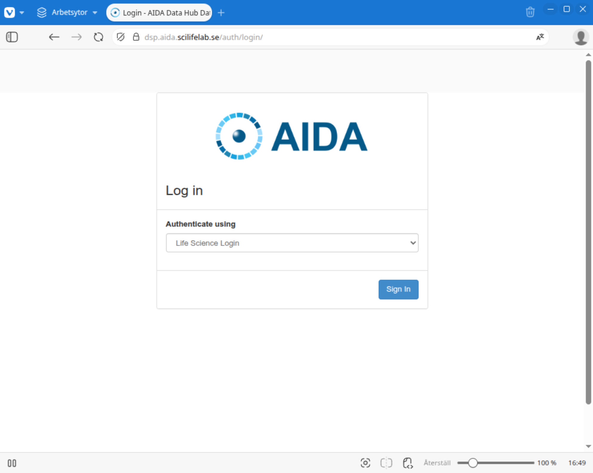
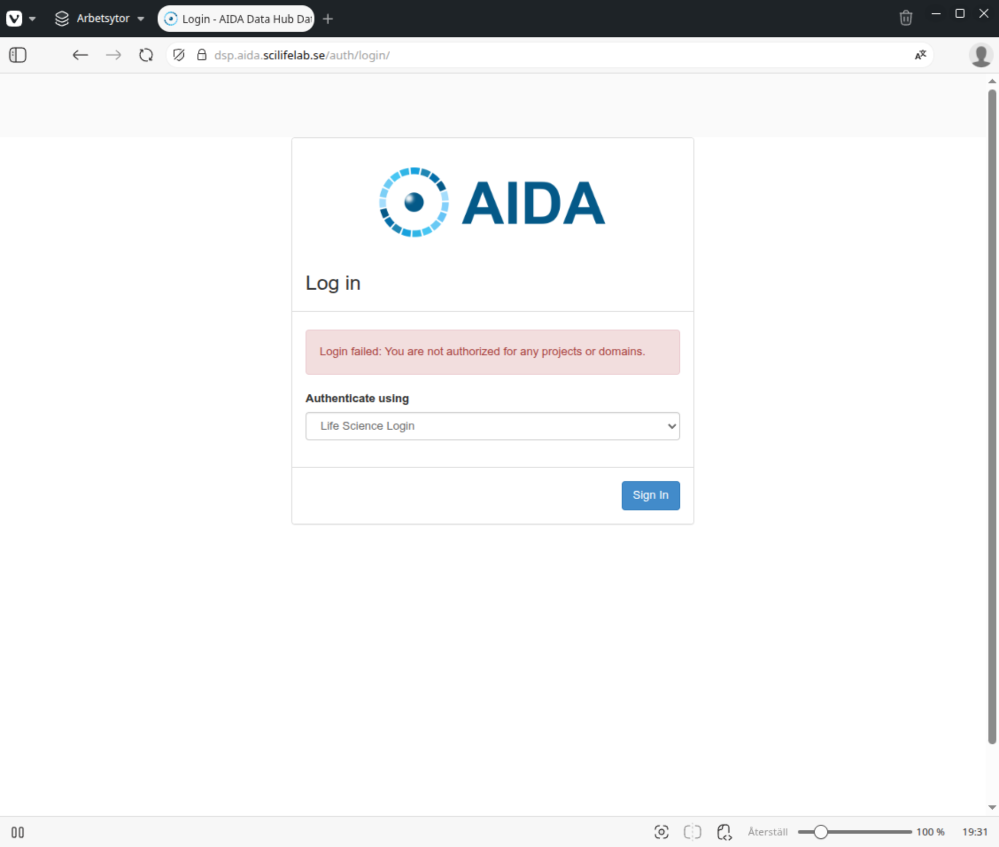
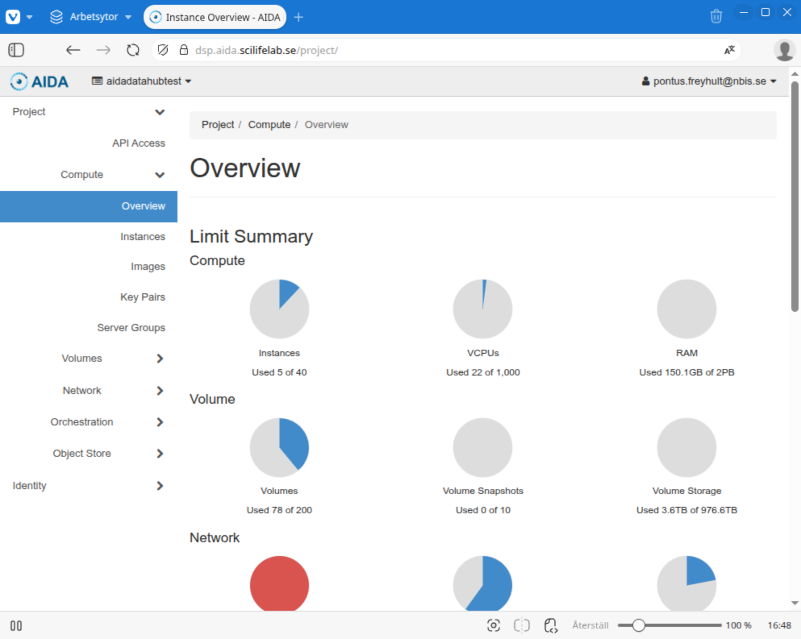

# First login to DSP

While the Data Science Platform tries not to raise to many hurdles, some things
are required to make a secure system. Keeping track of who is using it is one
such basic thing.

When you go to [the DSP login page](https://dsp.aida.scilifelab.se/) you'll be
greeted by a simple screen where you today only have the choice of
authenticating with [Life Science Login](https://lifescience-ri.eu/ls-login/).

.

If you have not already registered with Life Science login, please follow [this guide to do so](life-science-login.md).

## Back at DSP

Once you have authenticated properly, on the first time you return, you will
not be let into DSP as your account needs to be assigned membership details.
Instead you will receive the message "Login failed: You are not authorized for
any projects or domains."

Once your account has been adjusted to allow log in, the next time you return
you will be let into Horizon.

