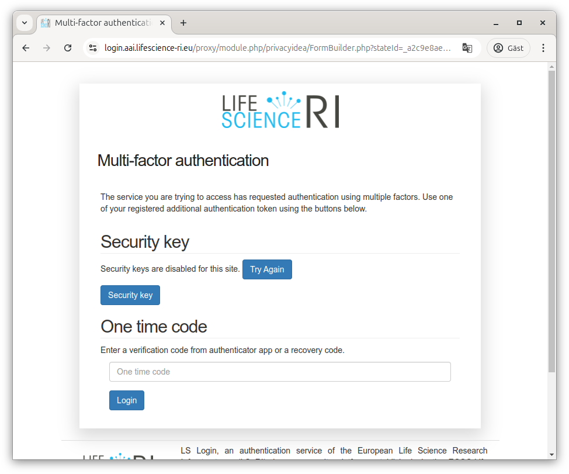
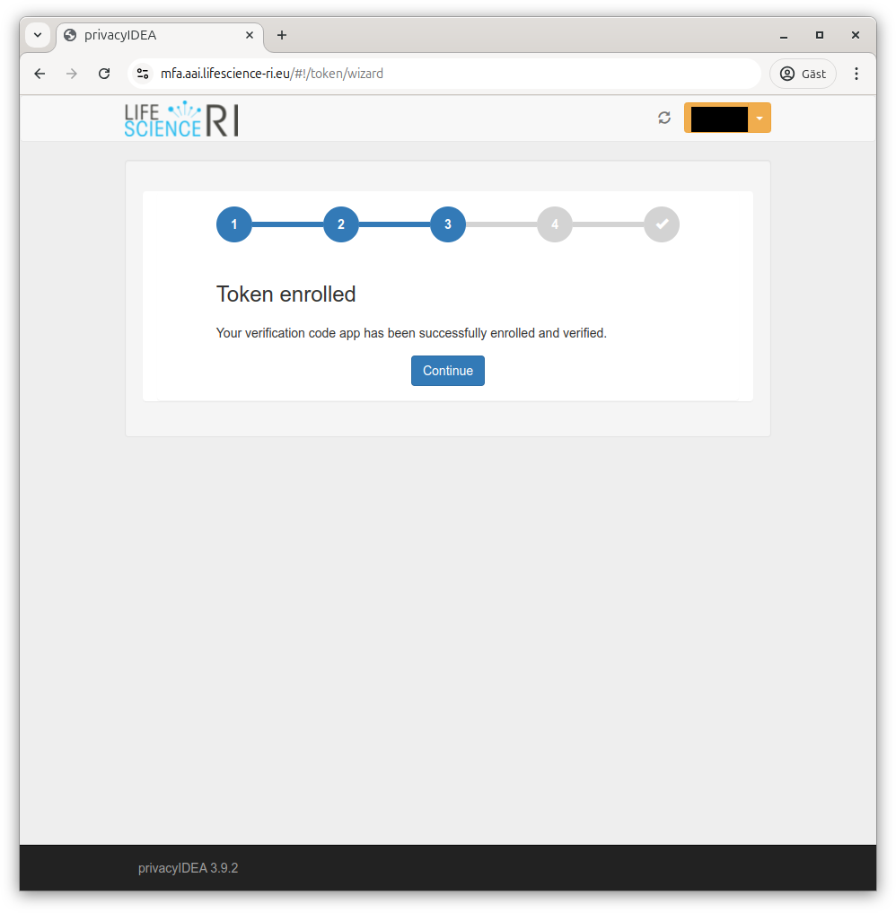
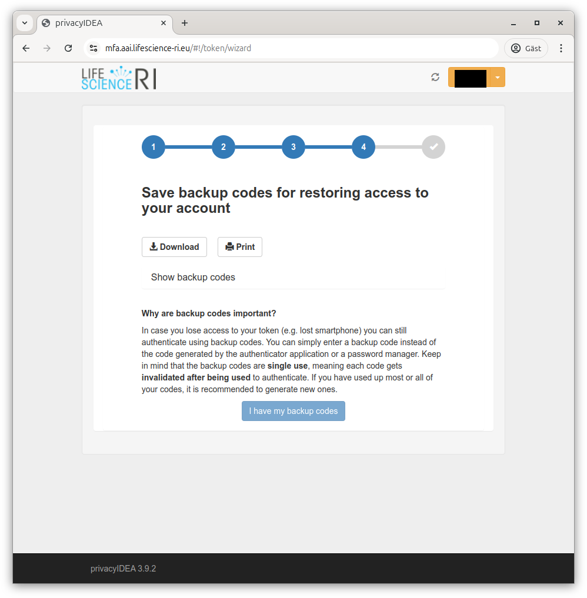

# Life Science federation login

AIDA Data Hub uses the Life Science federated login, a services 
operated by the European Life Science Research Infrastructures to greatly simplify authentication.

When you select to login to our services, you will be taken to the Life Science Login federated authentication, and will be greeted by a screen where you
can choose between different services, or type the name of your home
organisation to authenticate there if they are available (will likely be the
case for academia).

If your organisation is not available, there are other common services that can
be used for authentication (e.g. ORCID, GitHub, LinkedIn, Google, Apple), or if
you don't want to or are able to use one of these, you can use "LifeScience
Hostel" instead which allows signing up at LS Login directly.

## Using your home organisation email

If you use one of these other services, we recommend changing your profile
email to the one from your home organisation. This can be done on the
[LS Login User Profile site](https://profile.aai.lifescience-ri.eu/); look
for "Preferred mail" and click the pen to update the mail (note that the new
email must be verified which may take some time).

## Multifactor authentication

Once logged in, you would normally be passed back to the service that requested
authentication. But as our services support working with sensitive
data, you will also be required to use multi-factor authentication (somewhat
simplified that means just knowing a password should not be enough, typically
something more such as having a physical object should be required).

With Life Science Login, this means you will be asked to provide a second
factor before being able to advance to our services. 

If Life Science Login needs to do multifactor authentication by itself, you will
be sent to the [Life Science Login MFA site](https://mfa.aai.lifescience-ri.eu/).

For clarity; there's nothing wrong with using a hardware token (e.g. USB key) or
other solution, but since the Time-based One-Time Password (TOTP) support is the
common denominator, that's shown here.

.

Since Life Science Login tries to be useful, it supports using modern standards
for authentication over the web. Unfortunately, that may mean you get different
behaviours depending on what web browser you are using, whatever you have any
helper extensions (e.g. password manager), if you have a USB-key connect and
possibly even if you have a phone nearby.

Since those behaviours differ so much, we won't show them.

### Enrolling a new token for multifactor authentication

When arriving at the [MFA site](https://mfa.aai.lifescience-ri.eu/) the first
time, it will tell you who you are authenticated as in Life Science Login and
inform you that you get in without additional credentials this time.

You will then be guided through the enrollment flow, starting with the ability
to name your token.

Next, the flow tries to ensure you have a TOTP application available. It
suggests alternatives for Android and iOS, but you don't need to use those
applications as TOTP is a standard. The list of working apps include Twilio Authy,
Google Authenticator, Microsoft Authenticator, FortiToken, Duo security
authentication, common password managers and many more.

If you do not already use two-factor authentication with an app, we strongly
recommend choosing one that supports some kind of secure network synchronisation
to handle cases where your device stops working (this should do encryption on
device).

Once you have confirmed you have an app, it will show you a QR code for easy
addition of the second factor. If you are using a phone, you should be able to
scan that and hopefully have the account added automatically.

If not, you can ask it to reveal the secret as text and add that to your MFA
solution manually.

Once you have added the account to your solution, it should present you with
the current code (this will update regularly, at any time it is requested you
should enter what is currently shown).

If that works, it will remember that you have registered the account on your
side. It calls with that the "token is enrolled"

It will then let you know that multifactor authentication has been activated.

Next, it will inform you about backup codes (in case you loose your phone or
similar). Even if you have a solution that helps with network backup,
downloading backup codes and storing them securely is strongly recommended.

Once you've done that, MFA activation is complete.

## Attribute release

To operate our services, we need some additional details about you from Life 
Science Login. For them to be able to pass them to us, they need you to 
acknowledge that:

Click "Yes, continue" to let Life Science Login give us those details. If you
want to, you can choose "Remember" not to have to click through that screen
the next time.

## Back to AIDA Data Hub services

Once you've registered and accepted that our services can get additional details, you should be redirected back to the service for which you originally initiated the log in. You will now be able to use the same Life Science login profile for all of the AIDA Data Hub services (as well as any other of the European research infrastructures using it).