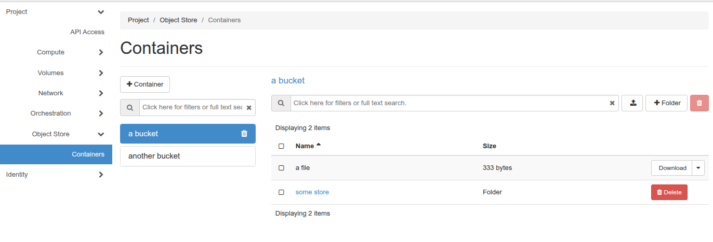

# Using object storage at DSP

## Introduction and terminology

DSP offers object storage through Ceph. This enables access through different
protocols, including s3 (as offered by AWS among others) and Swift. This means
that you can use a wide variety of clients to connect to the offered services.

Unfortunately, these services use different names for similar concepts - s3 use
the term bucket whereas swift uses container. Since it's the more widely used,
this document will use the s3 terminology of buckets, which should be
understandable in most cases (and is somewhat less prone to confusion whereas
container can refer to other concepts).

## Web interface

The cloud web interface (OpenStack Horizon) offers a built-in browser where
you can create buckets, browse existing buckets as well as upload and download
data.

This browser is available in Horizon under Project -> Object Store ->
Containers.



## Accessing via other means

### openstack client

The `openstack` command line tool allows access through its `object` and
`container` subcommand classes (assuming valid authentication, typically through
application credentials).

```bash
user@host:~$ openstack container list
+---------------+
| Name          |
+---------------+
| test          |
| important     |
| stuff         |
+---------------+
user@host:~$ 
```

```bash
user@host:~$ openstack object list test
+-----------------------------+
| Name                        |
+-----------------------------+
| some-data                   |
| something-else              |
| some/structure              |
+-----------------------------+
user@host:~$ 

```

### Creating credentials for s3 access

Access through s3 protocol is also possible, but likely requires acquiring a
separate set of credentials ("ec2 credentials").

Managing these is available in the Horizon web interface under Project -> API
Access, where "View Credentials" will trigger creation of credentials usable
for the currently selected project (secure environment).

Once credentials are created, theree will also be a button "Recreate EC2
Credentials".


[!IMPORTANT] For security reasons, we will start enforcing a finite life span
for credentials for S3 (EC2 credentials). The process for how this will be done
is still to be determined, though.

### Using s3 clients

#### s3cmd

[s3cmd](https://s3tools.org/s3cmd) is client fairly common (for historical
reasons if nothing else).

After creating credentials, you can make a configuration such as

```text
[default]
host_bucket = s3.dsp.aida.scilifelab.se
host_base = s3.dsp.aida.scilifelab.se
access_key = YOURACCESSKEY
secret_key = YOURSECRETKEY
```

replacing `YOURACCESSKEY` and `YOURSECRETKEY` with those from your credentials,
respectively.

If you store that in e.g. `s3cmd-dsp.conf`, you can then use `s3cmd` such as

```bash
user@host:~$ s3cmd -c s3cmd-dsp.conf ls s3:///
2025-09-11 07:53  s3://test
2025-03-21 12:02  s3://another
user@host:~$ s3cmd -c s3cmd-dsp.conf ls s3://test/
                          DIR  s3://test/scripts/
2025-04-28 18:02       341976  s3://test/logo.png
user@host:~$
```

#### s3fs

If you are on a system where it's suppored, you can mount buckets using one
of many fuse-solutions, here's one called s3fs shown (mounting the bucket
`another` to the directory `data`).

```bash
user@host:~$ export AWS_ACCESS_KEY_ID=YOURACCESSKEY
user@host:~$ export AWS_SECRET_ACCESS_KEY=YOURSECRETKEY
user@host:~$ mkdir -p data
user@host:~$ s3fs -o url=https://s3.dsp.aida.scilifelab.se/ another data
user@host:~$ ls data
bin lib test.py
user@host:~$ umount -l data
```

## Access control

There is a built-in system for access control that allows for fine grained
management of rights. We expect to functionality for offering presets (e.g.
"allow internal access only"). For now this needs to be managed manually by
the user though.