# Setting up and logging into a machine in DSP

This guide assumes you have access to the Horizon interface, if not, see
[the first login guide](first-login.md).

## Some terminology

Some terms used in OpenStack may need some explanation:

* an instance means an actual virtual machine (VM), it can be turned off (in
  state `shutdown`) or running, spawning and so on
* a flavor is a resource specification for a type of virtual machine, e.g. 
  say that a small machine can have 1 cpu core, 1 GByte of RAM and no disk)
* a volume is a virtual disk
* a security group is how OpenStack manages traffic filtering for a machine. In
  OpenStack all traffic is disallowed unless there is a rule in a security group
  attached to the machine specifying that the specific traffic is allowed. This
  can be done with various filters (e.g. IP addresses, port, direction and so
  on)
* ingress mean incoming
* egress mean outgoing
* a floating ip is a virtual IP address that can be assigned to a machine to
  make it reachable at that address, but in contrast to "regular" addresses,
  these will typically not show up on the machine and can also be removed and
  reassigned at any time
* server groups is a way of grouping virtual machines together for purposes of
  scheduling in openstack ("affinity"), it can be used to say that some virtual
  machines should run on the same physical host (to offer higher bandwidth and
  lower latency for things that talk to a lot) or on different physical hosts
  to add fault-tolerance

## Pecularities for DSP

Since DSP aims to support research on sensitive data, there a a few things that
differ from what you'd normally encounter in a cloud setup.

The most important is that there is no way to connect to virtual machines
directly. It's quite common that virtual machines use internal networking and
can be connected to the outside world by assigning an IP from a "public"
network.

This can be done within DSP as well, but the public network is completely
internal to the DSP, so exposing a machine on the public network in DSP lets
you connect to it through our gateway **or from other DSP projects** if your
security groups allow it.

## Preparations

To be able to access any virtual machines you create, you will need to be
able to authenticate to it. In practice, this means you should upload the public
part of a ssh key pair so it can be preloaded on machines you create.

This is accessible in Horizon under Compute &#2092; Key Pairs where you can see
your keys and import or create new ones.

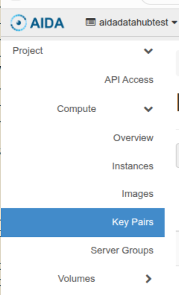

On the key pairs screen, your known key pairs will be listed and you have
buttons to create a new key pair (you probably don't want to use this),
import a key and delete a key.


Click the "Import Public Key" to open the key importer.

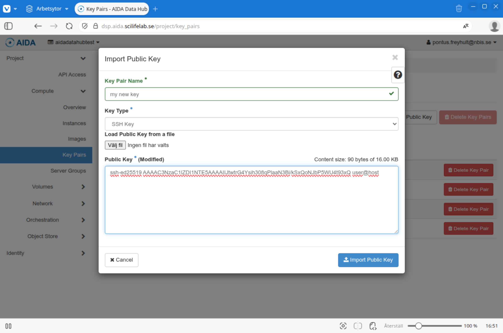

Choose a name for your key, select the type (SSH Key) and either upload or copy
paste the **public** part of your key pair (authentication depends on you 
proving you have the private part which can be verified by someone that has
the public part).

## Creating a VM

Now, you can actually create a VM, go to the Instances screen (Compute &#2092; 
Instances).


Similarly as for key pairs, you get to see a list of resources (instances) and
have a few buttons for quick access.


Clicking the "Launch Instance" buttons brings up the instance launcher which
will guide you through the instance creation. While it has a guided flow, you
jump around as you please. You can see things you must take care of being marked
with an asterisk (*) in the left pane.

On the first screen, you enter a name and a description for your VM.

Once done, advance by clicking the "Next" button to the lower right.


On the second screen, you need to choose what to start. The "Select Boot Source"
lets you choose between Image (can be said to be a prepared VM),
"Instance Snapshot" (a snapshot you've taken from a VM previously), "Volume" (a
virtual disk) or "Volume Snapshot".

Typically you will be using Image unless you have a special use case.

To choose what to start from, click the up arrow button to the right in the
list of available resources. We'll use the "Ubuntu Noble server" image for this
demonstration.

Once done, advance by clicking the "Next" button to the lower right.

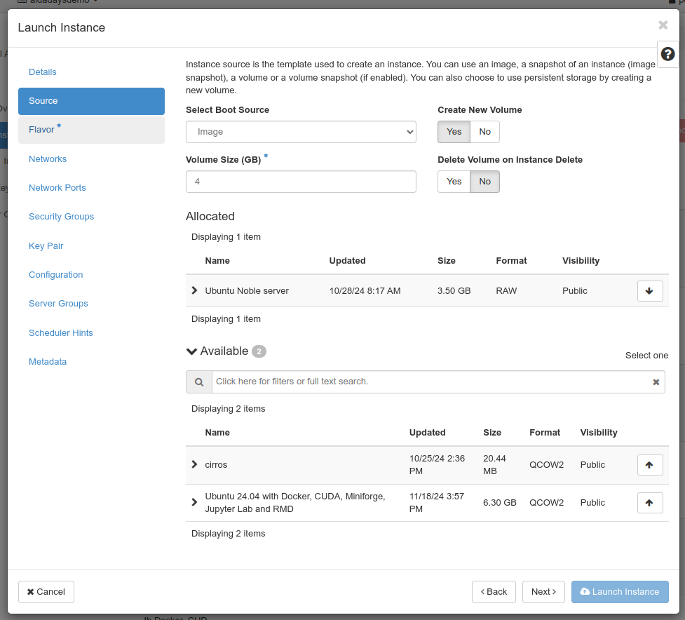

Next, you'll need to choose the flavor to use. A flavor in OpenStack describes
the resources (memory, cores, disk and such, GPUs) allocated to the VM. Same
as for the Image, choosing one is done by using the arrow up button to the right
in the list.

Once this is done, you can normally start your VM by using "Launch Instance"
at the lower right (it should activate once you choose a flavor), but for this
guide we'll go through the other possible steps.

If you choose Image or Instance snapshot as source, you have the option of
creating a new volume (virtual disk) for it, and if so, what size it should have
(if you need more than the default suggested by the image) and if it should be
automatically deleted when you remove your virtual machine.

Advance by clicking the "Next" button to the lower right.

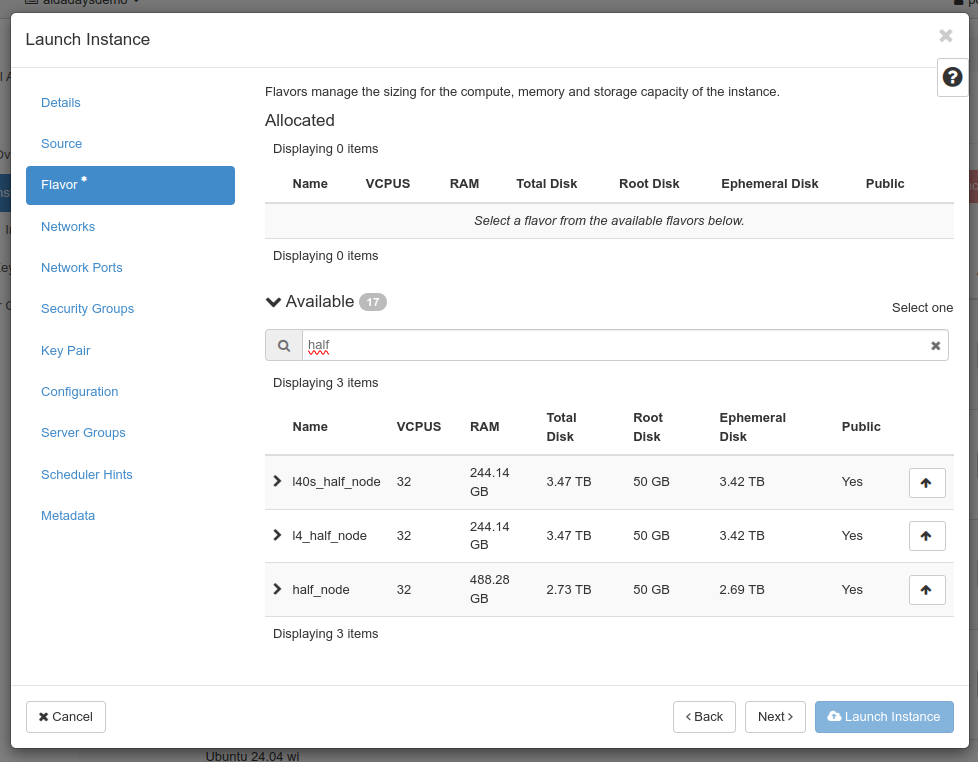

Next up is the networks screen which allows e.g. choosing what virtual networks
are connected if you have access to many. It's unlikely you will want to do
anything there for now.

Advance by clicking the "Next" button to the lower right.

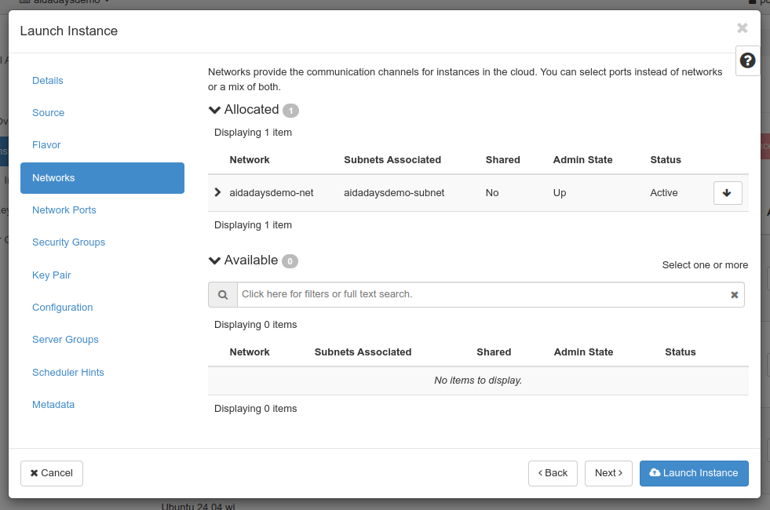

Next up is the network ports screen which allows e.g. choosing what virtual
network connectors that are used if you have access to many. You probably don't
need to do anything here..

Advance by clicking the "Next" button to the lower right.

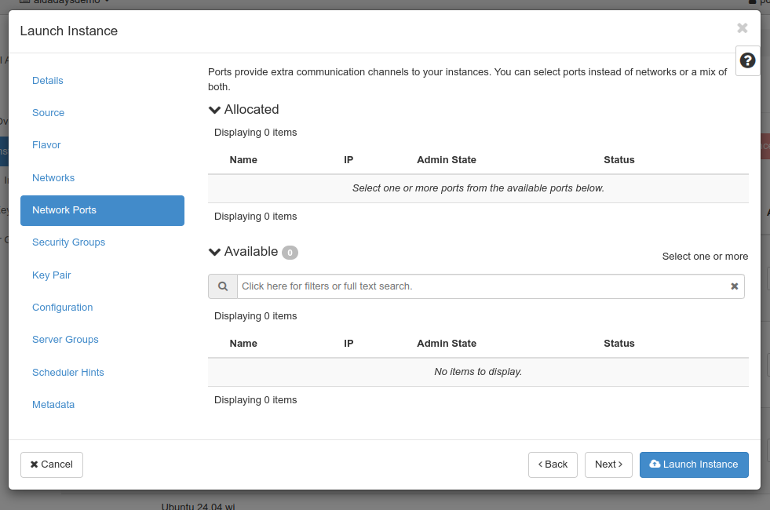

Security groups determine what security groups are attached to the virtual
machine. A machine can have any number of security groups attached, each
attached will potentially allow additional traffic to/from the VM.

Advance by clicking the "Next" button to the lower right.

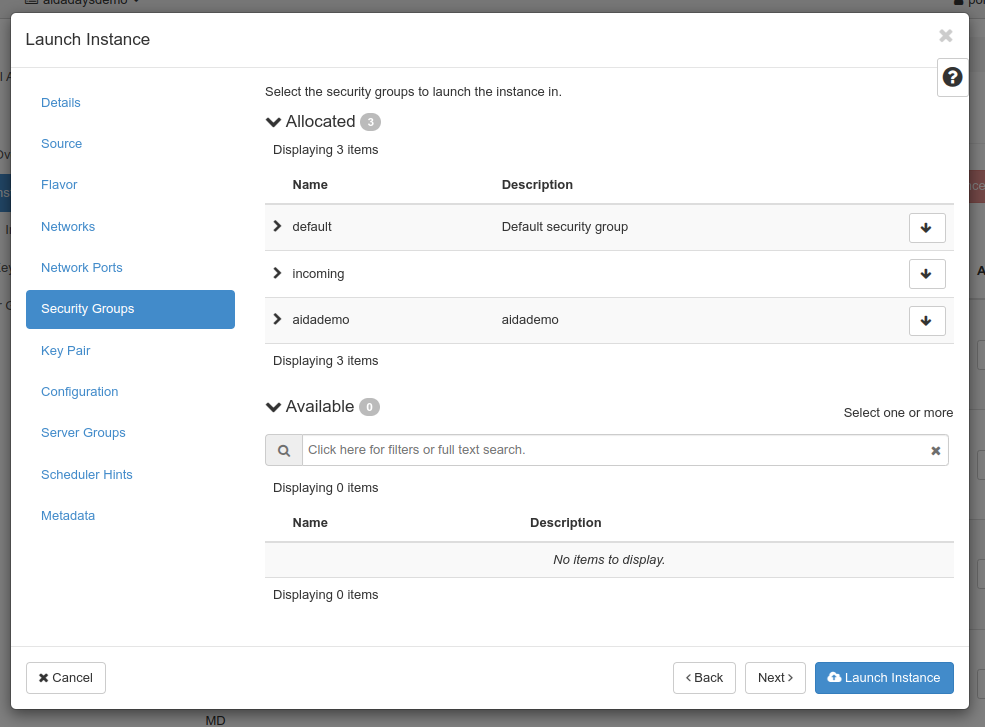

Next up is the key pair screen which lets you choose which key pair to preload.
Same as with other screens, you can select one by clicking the arrow up button.

At most one can be selected at the same time.

The selected key pair will be offered as information to the virtual machine,
there's no guarantee it's used (e.g. an instance snapshot might not care about)
it at all.

For virtual machines images intended to be used to create virtual machines, this
will typically be assigned to the default user for the image. For e.g. an Ubuntu
image, it will be added to the `ubuntu` user.

Advance by clicking the "Next" button to the lower right.

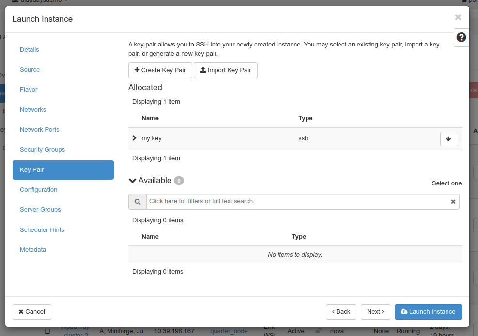

The technology used to offer the key pair chosen above can do a lot more - see
[the cloud-init documentation](https://cloudinit.readthedocs.io/) for more
informtation.

The Configuration screen allows you to provide more configuration. That can
be used to e.g. pre-create some additional users, set a password, partition
drives or other things.

This is an advanced future that will not be used in this guide.

Advance by clicking the "Next" button to the lower right.

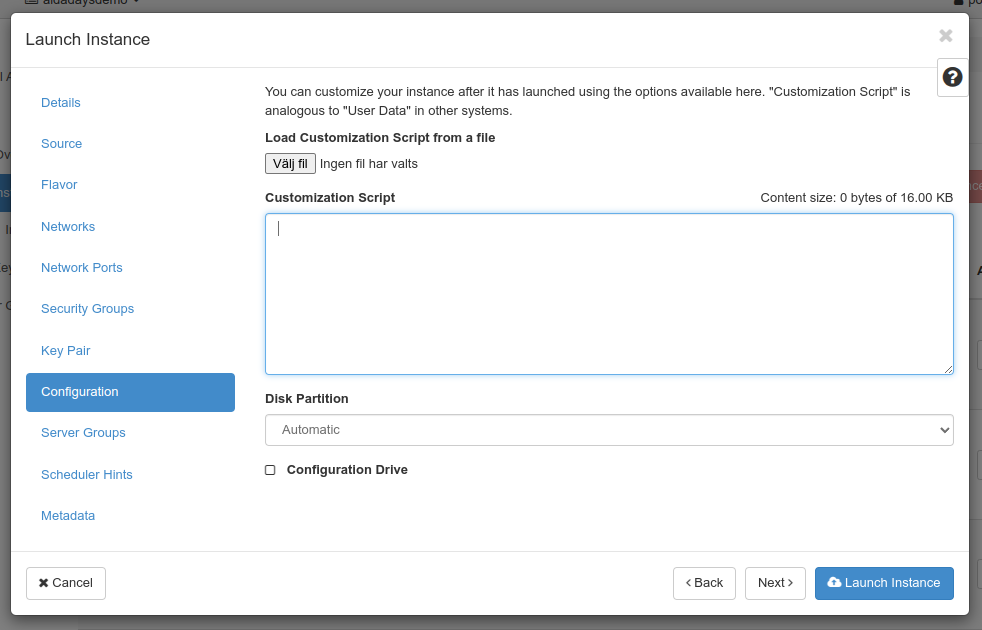

Next up is the server group screen where you can decide which (if any) server
groups a virtual machine should belong to. These will be used to decide how
scheduling happens.

This is an advanced future that will not be used in this guide.

Advance by clicking the "Next" button to the lower right.


Next up is the scheduler hints screen where you can provide hints for the
scheduler.

This is an advanced future that will not be used in this guide.

Advance by clicking the "Next" button to the lower right.

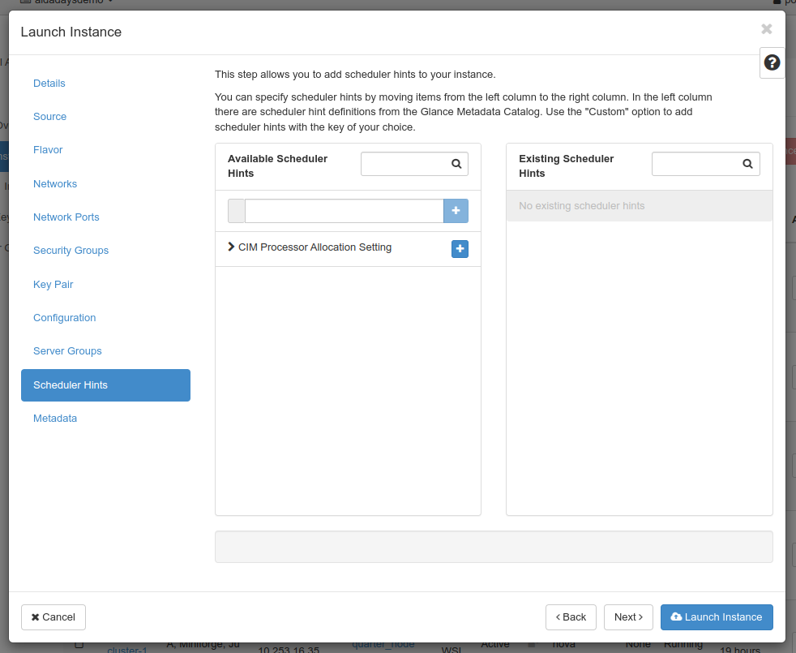

Finally the metadata screen allows you assign metadata to the virtual machine,
either from a list of preloaded suggestions or custom keys (once added to your
virtual machine you can provide values).

Since we've reached the end of the guided experience, we'll create our virtual
machine by clicking "Launch Instance".

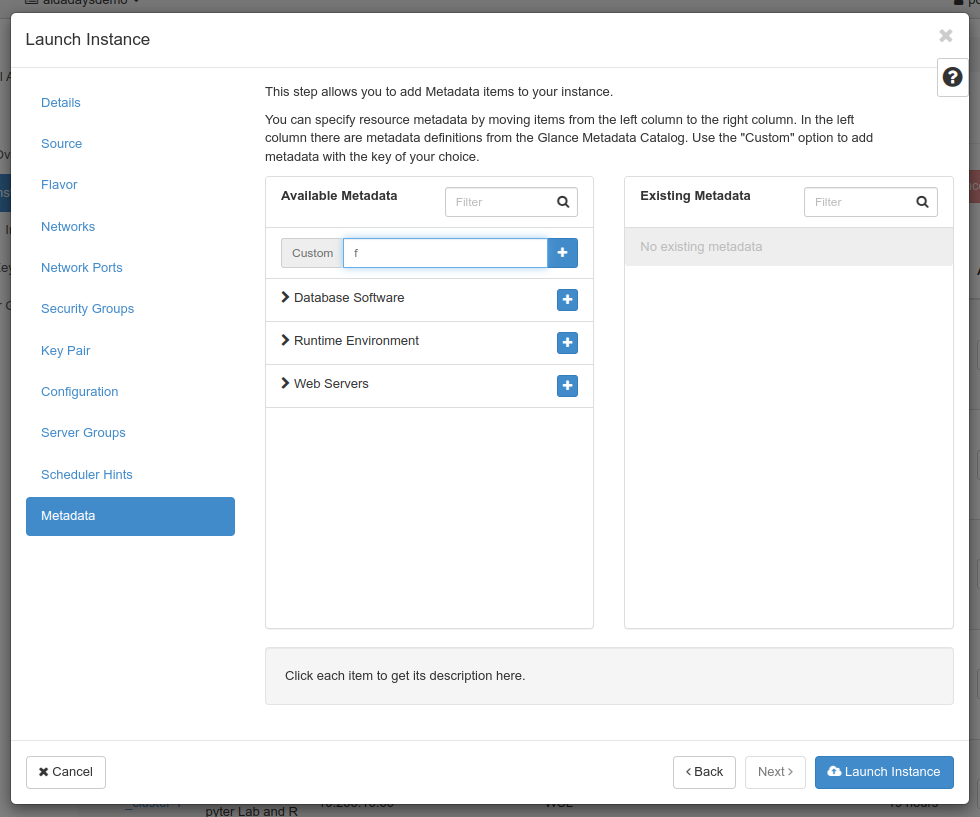

After a short while, you'll be taken back to the Instance view where after some
time your new virtual machine should pop up in the list. It will go through
various stages but unless there is an issue, it should end up in Power state
"Running", meaning it's powered on.

You have a button for quick actions to the right or you can click your machine
to go into the details screen for it.


After clicking your virtual machine to see more details, you will be presented
with a view with more information in various tab, e.g. an overview.

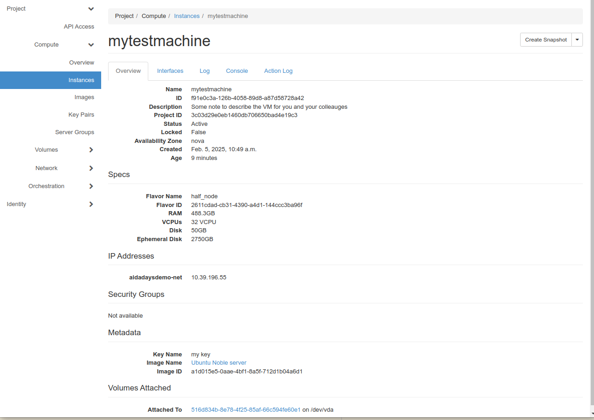

There is also a tab for the machine log that can be useful when troubleshooting.


And there is a console tab for emergency access to the "graphical console" of
the virtual machine. This is not indented to be used for a virtual desktop but
rather for emergency cases (e.g. while it was stopped you disconnected and
deleted a volume that is no longer needed but is expected to be mounted at
start).

Since we're happy with the virtual machine, we click the actions menu button to
the upper right to fold out the menu.

Some operations that are considered especially dangerous is marked by using
another text color (red instead of black here).


Since we want to reach our VM from the outside, we'll go ahead and click
"Associate floating IP" from the list.

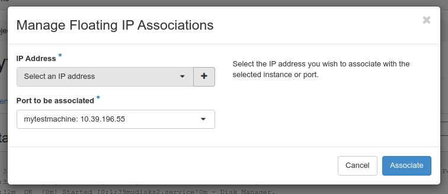

There will be a drop-down list of addresses to choose from at IP address. We
pick one at random.

Port to be associated will be filled in correctly for most cases, so we
disregard that for now. and click "Associate".


Once we've chosen, the new address will be visible in the overview tab as well
as in the virtual machine list on the main Instances screen.

But before we're done, we also need to actually make the virtual machine
accessible, this is done by adding security groups that allow the traffic we
want.

To do this, we use the actions drop-down menu to select "Edit Security Groups".
Note that there is currently a bug in the graphical interface so that active
groups aren't shown correctly, but that doesn't stop us here, for right now,
let's add all groups.

Once we're done, we chose "Save" to make the changes happen.

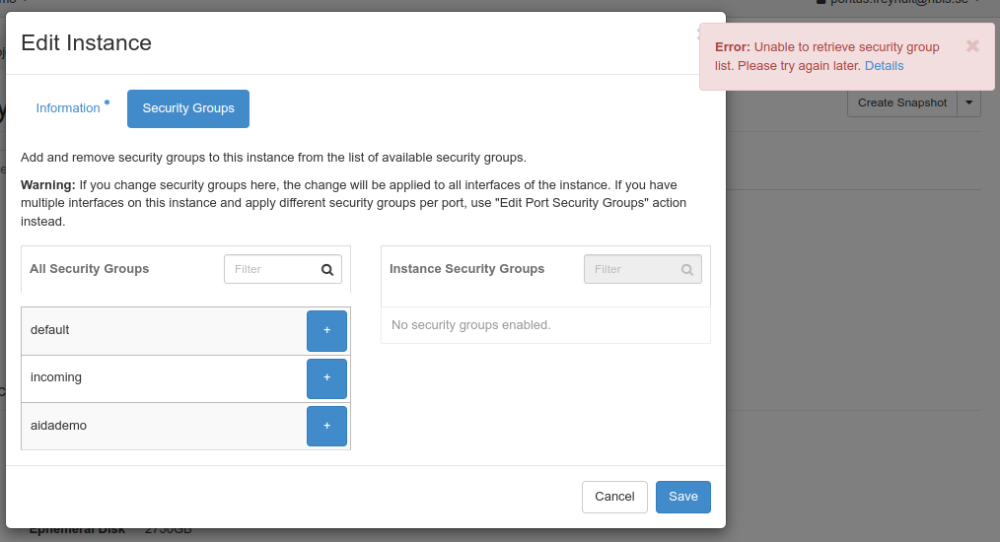

## Connecting to the virtual machine

Now, we can finally try to connect to our new virtual machine. To do so,
we need to use the floating IP we associated with the machine earlier.

In this case, it's `10.253.16.34`.

Since it's the most common and versatile, we'll use the standard OpenSSH ssh
client here, but similar functionality should be achievable with other clients.

As quick a quick connection without doing any configuration, we can connect with

```bash
ssh -o "ProxyJump your.email@example.com@dsp.aida.scilifelab.se" ubuntu@10.253.16.34
```

where `your.email@example.com` is replaced by your actual e-mail address used
for DSP. There will be a lot of `@` characters on that line, but it's fine.

Running that command will probably ask you to about the key the first time. 
It's a good habit to verify unknown keys, so we should do that. The key for DSP
has fingerprint as below.

```bash
256 SHA256:vg/InkHbVMb3FEyouth7f+WLi1OtEKgOJ88q49fVmj0 dsp (ED25519)
+--[ED25519 256]--+
|             +o  |
|         .  . .. |
|          =.. .  |
|         +.o o   |
|      . S.. . o  |
|     = O.. o . ..|
|      &o=.+ o .o |
|   o o.Bo=.E..o .|
|  ..+.+ o+.o++...|
+----[SHA256]-----+
```

Once you've checked and approved the key (the ), you will be shown a banner with a
link.

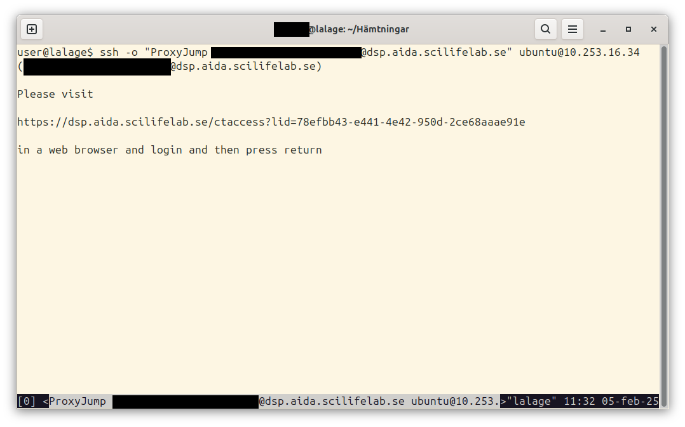

Clicking that link will prompt you to go through with authentication through
Life Science Login. If you go through that, you should end up on a page with a
short message:

```
You are now logged in as <your.email@example.com> and should be able to continue in your ssh session.
```

(where your.email@example.com should be your actual e-mail used for DSP).

Once you get that, you can go back to the terminal, pressing return there should
advance and allow your ssh client to connect your actual virtual machine.

But since it's a completely new machine, we don't have a way of verifying the
public key for it, so we'll need to go by faith here.

It'a also possible that you get problems here if you create, delete and create
many virtual machines and reuse the floating IPs to connect to, in that case
`ssh` will help by suggesting commands to clean up conflicting details from your
files.

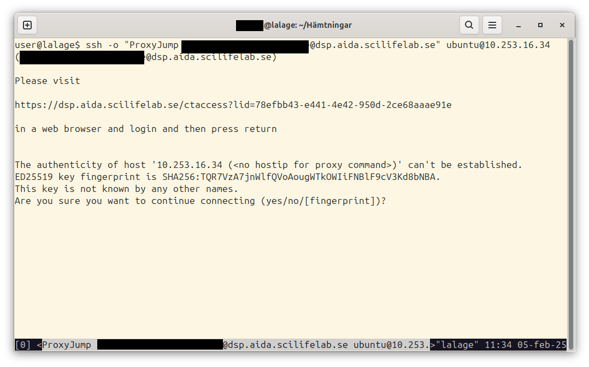

Accepting that public key will allow us to advance. Since we've given the
virtual machine our public key already, it can authenticate us and let us in.

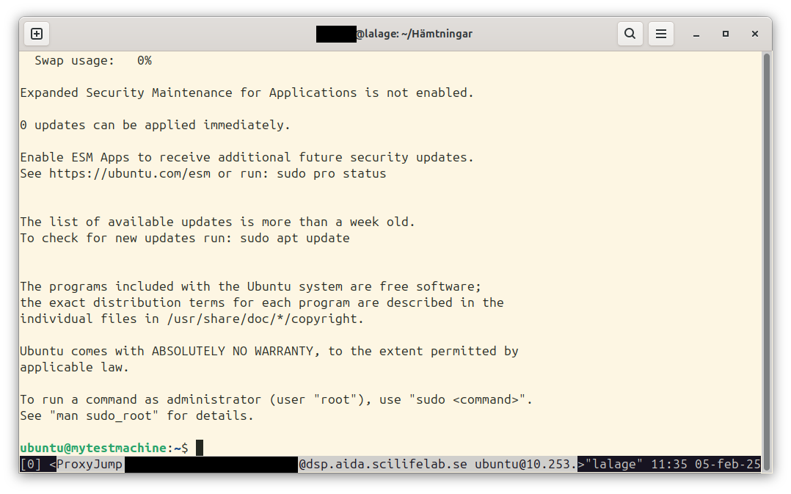

It is good practice to protect keys with a passphrase, but I didn't need to
type any here. That's because I use an agent to help with the keys so that I can
add them once at login by typing the passphrase and then don't need to type it
anymore. This is available with the `ssh-agent` tool, but also built in to many
common desktop environments, you can try e.g. `ssh-add -L` to list identities
your agent know of, and if that works (doesn't give an error message) you can
add your identities by e.g. `ssh-add ~/.ssh/mykeyfile` to add a specific key or
just `ssh-add` to go through the default key files OpenSSH will look for.

### Nicer configuration

While it works to do as above, it can be tiresome having to click links to
connect. Fortunately, OpenSSH offers way to improve the experience.

To get out of clicking the link, we can use something called `connection
multiplexing` which allows ssh to use a single connection to many different
things. This happens after authentication, so activating it for the gateway
means we can use it to connect multiple times.

Since this means authentication does not happen again, it's something to
consider and necessitate some precautions such as automatic locking when idle
and so on (but such precautions should typically be in place already if you work
with sensitive data).

The configuration below asks ssh that new connections should automatically set
up multiplexing and hang around after use, but stop after one half hour.
There are also other options for `ControlMaster`, allowing for requesting
confirmation before using the multiplexing, see the manual page `ssh_config(5)`.

```
ControlMaster auto
ControlPersist 1800
ControlPath ~/.ssh/socket-%r@%h-%p
```

OpenSSH also allows us to define things so we don't need to type it so much.

```
Host dspgateway
  Hostname dsp.aida.scilifelab.se
  User your.email@example.com
```

(where `your.email@example.com` should be replaced by your actual e-mail used
for DSP.)

And OpenSSH also offers the `ProxyJump` feature to automatically use tunneling
through a host, we can set this up for our VMs as such

```
Host 10.253.16.*
  ProxyJump dspgateway
  User ubuntu
```

combining these, we can put it in a file (e.g. `~/.ssh/dsp_config`) and add an
include statement for it in the main ssh configuration (`~/.ssh/config`) such as

```
Include dsp_config
```

with `dsp_config` consisting of

```
ControlMaster auto
ControlPersist 1800
ControlPath ~/.ssh/socket-%r@%h-%p

Host dspgateway
  Hostname dsp.aida.scilifelab.se
  User your.email@example.com

Host 10.253.16.*
  ProxyJump dspgateway
  User ubuntu
```

I can just use the IP directly:

```bash
$ ssh 10.253.16.34
Last login: Wed Feb  5 11:24:49 2025 from 10.253.254.251
To run a command as administrator (user "root"), use "sudo <command>".
See "man sudo_root" for details.

ubuntu@mytestmachine:~$ 
```

(notice that I get a different view here with no message-of-the-day because I'm
already logged in.)